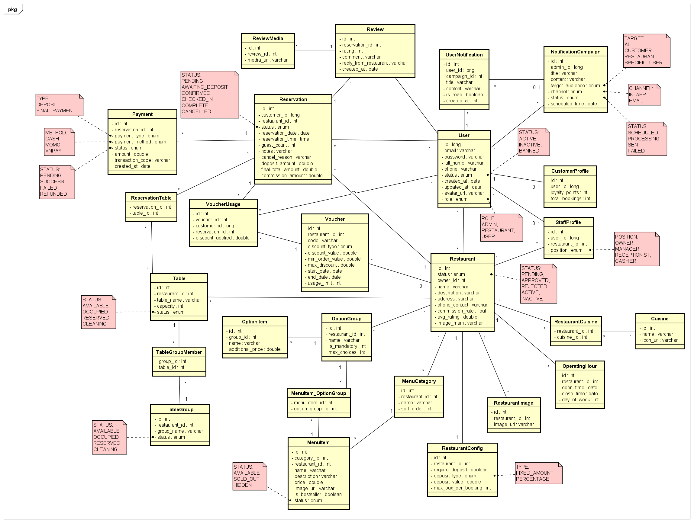

# 🗄️ Tài Liệu Thiết Kế Cơ Sở Dữ Liệu (Database Design) - Hệ Thống Đặt Bàn Nhà Hàng

**Sơ đồ (ERD):**

---

## 📌 DANH SÁCH CÁC ENUMS SỬ DỤNG TRONG HỆ THỐNG
Để tối ưu hóa cơ sở dữ liệu, hệ thống sử dụng các Enum sau cho các cột trạng thái/loại:

*   **USER_ROLE:** `ADMIN`, `RESTAURANT`, `USER`
*   **USER_STATUS:** `ACTIVE`, `INACTIVE`, `BANNED`
*   **STAFF_POSITION:** `OWNER`, `MANAGER`, `RECEPTIONIST`, `CASHIER`
*   **RESTAURANT_STATUS:** `PENDING`, `APPROVED`, `REJECTED`, `ACTIVE`, `INACTIVE`
*   **TABLE_STATUS:** `AVAILABLE`, `OCCUPIED`, `RESERVED`, `CLEANING`
*   **MENU_ITEM_STATUS:** `AVAILABLE`, `SOLD_OUT`, `HIDDEN`
*   **DEPOSIT_TYPE:** `FIXED_AMOUNT`, `PERCENTAGE`
*   **RESERVATION_STATUS:** `PENDING`, `AWAITING_DEPOSIT`, `CONFIRMED`, `CHECKED_IN`, `COMPLETE`, `CANCELLED`
*   **PAYMENT_TYPE:** `DEPOSIT`, `FINAL_PAYMENT`
*   **PAYMENT_METHOD:** `CASH`, `MOMO`, `VNPAY`
*   **PAYMENT_STATUS:** `PENDING`, `SUCCESS`, `FAILED`, `REFUNDED`
*   **CAMPAIGN_TARGET:** `ALL`, `CUSTOMER`, `RESTAURANT`, `SPECIFIC_USER`
*   **CAMPAIGN_CHANNEL:** `IN_APP`, `EMAIL`
*   **CAMPAIGN_STATUS:** `SCHEDULED`, `PROCESSING`, `SENT`, `FAILED`

---

## 🛠️ PHÂN HỆ 1: ADMIN
*Phân hệ lưu trữ thông tin tài khoản, phân quyền, hồ sơ cá nhân và hệ thống thông báo.*

### 1. Bảng `User` (Tài khoản)
| Tên cột | Kiểu dữ liệu | Khóa | Mô tả |
| :--- | :--- | :--- | :--- |
| `id` | long | **PK** | Định danh tài khoản |
| `email` | varchar | Unique | Email đăng nhập |
| `password` | varchar | | Mật khẩu (Đã mã hóa/Hash) |
| `full_name` | varchar | | Họ và tên |
| `phone` | varchar | Unique | Số điện thoại |
| `status` | enum | | Trạng thái tài khoản (ACTIVE, BANNED...) |
| `created_at` | date | | Ngày tạo tài khoản |
| `updated_at` | date | | Ngày cập nhật gần nhất |
| `avatar_url` | varchar | | Đường dẫn ảnh đại diện |
| `role` | enum | | Phân quyền (ADMIN, RESTAURANT, USER) |

### 2. Bảng `CustomerProfile` (Hồ sơ Khách hàng)
| Tên cột | Kiểu dữ liệu | Khóa | Mô tả |
| :--- | :--- | :--- | :--- |
| `id` | int | **PK** | |
| `user_id` | long | **FK** | Trỏ đến `User.id` (1 - 0..1) |
| `loyalty_points` | int | | Điểm tích lũy thành viên |
| `total_bookings` | int | | Tổng số lần đã đặt bàn thành công |

### 3. Bảng `StaffProfile` (Hồ sơ Nhân viên / Chủ quán)
| Tên cột | Kiểu dữ liệu | Khóa | Mô tả |
| :--- | :--- | :--- | :--- |
| `id` | int | **PK** | |
| `user_id` | long | **FK** | Trỏ đến `User.id` (1 - 0..1) |
| `restaurant_id` | int | **FK** | Trỏ đến `Restaurant.id` |
| `position` | enum | | Chức vụ (OWNER, MANAGER...) |

### 4. Bảng `NotificationCampaign` (Chiến dịch Thông báo)
| Tên cột | Kiểu dữ liệu | Khóa | Mô tả |
| :--- | :--- | :--- | :--- |
| `id` | int | **PK** | |
| `admin_id` | long | **FK** | Trỏ đến `User.id` (Người tạo chiến dịch) |
| `title` | varchar | | Tiêu đề thông báo |
| `content` | varchar | | Nội dung chi tiết |
| `target_audience` | enum | | Đối tượng nhận (ALL, CUSTOMER...) |
| `channel` | enum | | Kênh gửi (IN_APP, EMAIL) |
| `status` | enum | | Trạng thái gửi (SENT, SCHEDULED...) |
| `scheduled_time` | date | | Thời gian hẹn giờ gửi (Nullable) |

### 5. Bảng `UserNotification` (Thông báo cá nhân)
| Tên cột | Kiểu dữ liệu | Khóa | Mô tả |
| :--- | :--- | :--- | :--- |
| `id` | int | **PK** | |
| `user_id` | long | **FK** | Người nhận thông báo (`User.id`) |
| `campaign_id` | int | **FK** | Thuộc chiến dịch nào (`0..1` - Null nếu hệ thống tự động gửi) |
| `title` | varchar | | Tiêu đề hiển thị cho user |
| `content` | varchar | | Nội dung |
| `is_read` | boolean | | Cờ đánh dấu đã đọc |
| `created_at` | int | | Thời gian nhận |

---
