# Phân Tích Yêu Cầu & Đặc Tả Use Case - Hệ Thống Đặt Bàn Nhà Hàng

## 1. Phân Tích Yêu Cầu (Requirements Analysis)
Hiện nay, việc đặt bàn tại các nhà hàng thường diễn ra thủ công qua điện thoại hoặc đến trực tiếp. Khách hàng gặp khó khăn trong việc tìm kiếm không gian phù hợp, không biết trước thực đơn, giá cả và tình trạng bàn trống. Ngược lại, các nhà hàng cũng chật vật với việc quản lý lịch hẹn bằng sổ sách, khó sắp xếp sơ đồ bàn tối ưu và thường xuyên chịu thiệt hại do tình trạng khách đặt nhưng không đến (no-show). Để giải quyết triệt để vấn đề này, **"Hệ Thống Đặt Bàn Nhà Hàng Trực Tuyến"** được xây dựng nhằm tạo ra một nền tảng (platform) số hóa, làm cầu nối trực tiếp giữa thực khách và các cơ sở kinh doanh dịch vụ F&B.

Hệ thống được thiết kế để mang lại lợi ích toàn diện cho cả 3 nhóm đối tượng tham gia. Đối với **Khách hàng**, nền tảng mang đến trải nghiệm tiện lợi khi cho phép tìm kiếm nhà hàng theo vị trí/loại ẩm thực (cuisine), tham khảo menu, đặt chỗ 24/7 và thanh toán tiền cọc an toàn qua cổng điện tử (VNPay/Momo). Đối với **Nhà hàng**, hệ thống cung cấp bộ công cụ quản trị mạnh mẽ giúp số hóa thực đơn, theo dõi sơ đồ bàn trực quan theo thời gian thực, quản lý đơn hàng và tự động hóa quy trình xác nhận. Cuối cùng, đối với **Ban quản trị (Admin)**, hệ thống cung cấp các công cụ kiểm duyệt đối tác chặt chẽ, cấu hình mức chiết khấu (commission) linh hoạt và hệ thống báo cáo thống kê tổng quan để theo dõi, định hướng sự phát triển của toàn bộ nền tảng.

### 1.1. Đối tượng sử dụng (Actors)
Hệ thống bao gồm 3 phân hệ người dùng chính:
*   **Khách hàng (End User):** Người dùng cuối tìm kiếm nhà hàng, xem menu, đặt bàn và đánh giá.
*   **Nhà hàng (Business User):** Quản lý thông tin gian hàng, thực đơn, sơ đồ bàn và xử lý đơn đặt bàn.
*   **Admin (Quản trị hệ thống):** Quản lý toàn bộ hoạt động của nền tảng, duyệt nhà hàng, cấu hình hệ thống và xem báo cáo.
*   **Actor phụ (Hệ thống ngoài):** Cổng thanh toán (VNPay/Momo), Hệ thống gửi Email, Dịch vụ lưu trữ ảnh (Cloudinary/S3).

---

## 2. Sơ Đồ Use Case Tổng Quát (General Use Case Diagram)
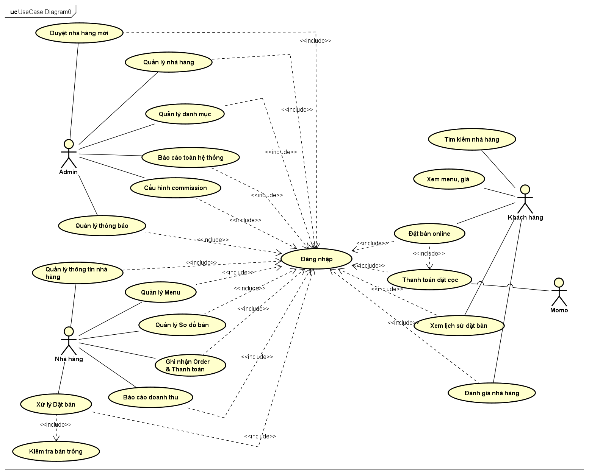

---

## 3. Đặc Tả Use Case & Wireframes Theo Từng Phân Hệ

### 3.1. Phân hệ Khách hàng (Customer)
#### 3.1.1. Sơ đồ Use Case Khách hàng

#### 3.1.2. Chi tiết Đặc tả & Wireframes
**1. UC_CUSTOMER_01: Tìm kiếm nhà hàng**

| Trường thông tin | Nội dung |
| :--- | :--- |
| **Use case Id** | UC_CUSTOMER_01 |
| **Name** (Tên use case) | Tìm kiếm nhà hàng |
| **Description** (Mô tả) | Use case này cho phép Khách hàng tìm kiếm các nhà hàng trên hệ thống dựa trên từ khóa (tên nhà hàng) hoặc kết hợp với các bộ lọc (vị trí, loại ẩm thực - cuisine, khoảng giá). Hệ thống cũng cung cấp tính năng gợi ý nhà hàng khi khách hàng bắt đầu tìm kiếm. |
| **Primary Actor** (Actor chính) | Khách hàng (End User) |
| **Secondary Actor** (Actor phụ) | Hệ thống Cơ sở dữ liệu (PostgreSQL/MySQL) |
| **Pre-conditions** (Tiền điều kiện) | 1. Khách hàng truy cập vào trang chủ hoặc trang tìm kiếm của ứng dụng. 2. *(Không bắt buộc)* Khách hàng có thể đã đăng nhập hoặc chưa đăng nhập. |
| **Post-conditions** (Hậu điều kiện) | **Thành công:** 1. Hệ thống hiển thị danh sách các nhà hàng phù hợp với tiêu chí tìm kiếm/lọc của khách hàng.  **Thất bại:** 1. Hệ thống hiển thị thông báo không tìm thấy kết quả hoặc thông báo lỗi hệ thống. |
| **Main flows** (Luồng hoạt động chính) | 1. Use case bắt đầu khi Khách hàng truy cập vào trang chủ hoặc trang tìm kiếm. 2. Khách hàng nhập từ khóa (Ví dụ: "Hải sản", "Bún chả") vào thanh tìm kiếm. 3. Khách hàng chọn thêm các tiêu chí lọc nếu muốn (Ví dụ: Khu vực: "Quận 1", Cuisine: "Món Việt") . 4. Khách hàng nhấn nút **"Tìm kiếm"** (hoặc nhấn Enter/biểu tượng kính lúp). 5. Ứng dụng (Frontend) thu thập từ khóa và các tham số lọc, gửi yêu cầu `GET` xuống Backend. 6. Backend tiếp nhận yêu cầu, xử lý logic và truy vấn Cơ sở dữ liệu (CSDL) để tìm các nhà hàng khớp với điều kiện. 7. Backend trả về danh sách nhà hàng (có phân trang), bao gồm các thông tin tóm tắt: Tên nhà hàng, Hình ảnh đại diện, Địa chỉ, Điểm đánh giá trung bình, và Trạng thái (Đang mở/Đóng cửa). 8. Frontend hiển thị danh sách kết quả tìm kiếm cho Khách hàng. 9. Khách hàng có thể cuộn để xem, chuyển trang, hoặc nhấn vào một nhà hàng cụ thể để xem chi tiết. 10. Use case kết thúc. |
| **Alternative flows** (Luồng thay thế) | **2a. Hiển thị Gợi ý nhà hàng :** 1. Tại bước 2, ngay khi Khách hàng click chuột vào thanh tìm kiếm (chưa gõ từ khóa hoặc mới gõ 1-2 ký tự). 2. Frontend tự động gọi API lấy danh sách gợi ý (Ví dụ: Các nhà hàng đang hot, Top nhà hàng được đặt nhiều nhất, hoặc Lịch sử tìm kiếm gần đây). 3. Hệ thống hiển thị danh sách gợi ý dưới dạng dropdown (trình đơn thả xuống). 4. Khách hàng click chọn trực tiếp một nhà hàng trong danh sách gợi ý. 5. Hệ thống chuyển hướng Khách hàng thẳng đến trang "Xem chi tiết nhà hàng" đó. 6. Use case kết thúc sớm.  **7a. Không tìm thấy kết quả phù hợp:** 1. Tại bước 6, Backend truy vấn CSDL nhưng không có nhà hàng nào khớp với từ khóa và bộ lọc của Khách hàng. 2. Backend trả về một mảng dữ liệu rỗng. 3. Frontend hiển thị thông báo: *"Rất tiếc, không tìm thấy nhà hàng nào phù hợp với tìm kiếm của bạn."* 4. Hệ thống tự động hiển thị thêm một danh sách *"Gợi ý các nhà hàng khác bạn có thể thích"* để giữ chân khách hàng. 5. Khách hàng thay đổi từ khóa/bộ lọc và tìm kiếm lại (Quay lại Bước 2).  **2b. Tìm kiếm trống (Chỉ sử dụng bộ lọc):** 1. Tại bước 2, Khách hàng để trống thanh tìm kiếm từ khóa. 2. Tại bước 3, Khách hàng chỉ chọn bộ lọc (Ví dụ: Chỉ chọn Cuisine "Món Nhật"). 3. Hệ thống vẫn xử lý bình thường, Backend sẽ bỏ qua điều kiện từ khóa và trả về toàn bộ danh sách nhà hàng "Món Nhật". 4. Luồng hoạt động tiếp tục tại Bước 7. |
| **Exception flows** (Luồng ngoại lệ) | **5a. Lỗi dữ liệu đầu vào:** 1. Tại bước 5, Khách hàng (hoặc bot) cố tình can thiệp vào URL, truyền lên các tham số tìm kiếm độc hại (Ví dụ: chứa mã SQL Injection, mã XSS, hoặc tham số phân trang âm ). 2. Backend (thông qua Spring Validation) phát hiện dữ liệu không hợp lệ hoặc chứa ký tự nguy hiểm. 3. Backend chặn truy vấn ngay lập tức và trả về mã lỗi `400 Bad Request`. 4. Frontend hiển thị thông báo: *"Dữ liệu tìm kiếm không hợp lệ. Vui lòng thử lại."* 5. Use case kết thúc thất bại.  **6a. Lỗi kết nối Cơ sở dữ liệu (Database Timeout/Down):** 1. Tại bước 6, Backend không thể kết nối tới PostgreSQL/MySQL hoặc câu lệnh truy vấn tìm kiếm chạy quá lâu gây Timeout (do hệ thống đang quá tải). 2. Backend bắt lỗi và trả về mã `500 Internal Server Error` hoặc `504 Gateway Timeout`. 3. Frontend hiển thị thông báo lỗi: *"Hệ thống đang bận hoặc mất kết nối. Vui lòng thử lại sau ít phút."* 4. Use case kết thúc thất bại. |

---

*Wireframe tương ứng:*

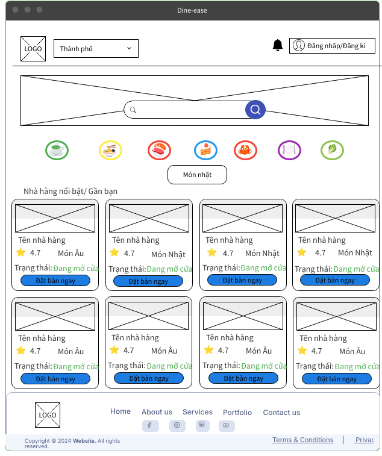

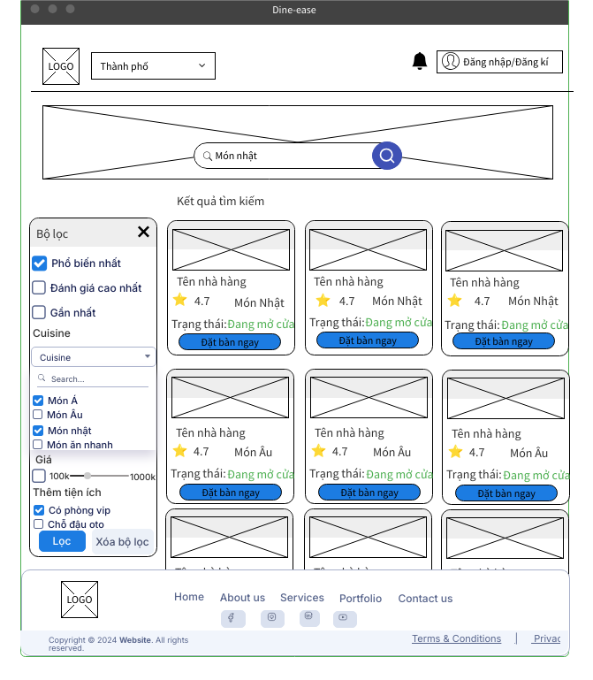

**2. UC_CUSTOMER_02: Xem menu và giá**
| Trường thông tin | Nội dung |
| :--- | :--- |
| **Use case Id** | UC_CUSTOMER_02 |
| **Name** (Tên use case) | Xem menu và giá |
| **Description** (Mô tả) | Use case này cho phép Khách hàng xem danh sách các món ăn, đồ uống kèm theo giá tiền của một nhà hàng cụ thể. Khách hàng có thể lướt xem theo từng danh mục (Khai vị, Món chính...), xem chi tiết hình ảnh món ăn và tham khảo các món bán chạy nhất (Bestseller) để dễ dàng đưa ra quyết định trước khi đặt bàn. |
| **Primary Actor** (Actor chính) | Khách hàng (End User) |
| **Secondary Actor** (Actor phụ) | Hệ thống Cơ sở dữ liệu (PostgreSQL/MySQL) Dịch vụ lưu trữ hình ảnh (Cloudinary / AWS S3) |
| **Pre-conditions** (Tiền điều kiện) | 1. Khách hàng đang ở trang "Chi tiết nhà hàng" (sau khi đã click chọn một nhà hàng từ kết quả tìm kiếm hoặc trang chủ). |
| **Post-conditions** (Hậu điều kiện) | **Thành công:** 1. Hệ thống hiển thị đầy đủ danh sách món ăn, giá cả, phân loại và hình ảnh (nếu có).  **Thất bại:** 1. Hệ thống hiển thị thông báo lỗi không thể tải được thực đơn. |
| **Main flows** (Luồng hoạt động chính) | 1. Use case bắt đầu khi Khách hàng cuộn xuống phần "Thực đơn" (Menu) trên trang Chi tiết nhà hàng, hoặc nhấn vào tab "Menu". 2. Ứng dụng (Frontend) gửi yêu cầu kèm theo `restaurant_id` xuống Backend để lấy dữ liệu thực đơn. 3. Backend truy vấn CSDL, lấy danh sách các món ăn đang ở trạng thái "Đang bán" (Available), bao gồm: Tên món, Mô tả ngắn, Giá tiền, Phân loại danh mục, và URL hình ảnh thu nhỏ. 4. Backend trả dữ liệu về cho Frontend dưới dạng JSON. 5. Frontend phân nhóm dữ liệu và hiển thị danh sách các món ăn theo từng danh mục (Ví dụ: Menu Đồ uống, Menu Món chính). 6. Khách hàng lướt xem tên món, đọc mô tả thành phần và xem giá tiền. 7. Use case kết thúc (Khách hàng có đủ thông tin để chuyển sang bước Đặt bàn online). |
| **Alternative flows** (Luồng thay thế) | **6a. Khách hàng xem hình ảnh chi tiết món ăn:** 1. Tại bước 6, Khách hàng muốn xem kỹ hơn về một món ăn cụ thể nên click vào tên món hoặc ảnh thu nhỏ (thumbnail) của món đó. 2. Hệ thống hiển thị một Popup/Modal (hộp thoại nổi) phóng to hình ảnh sắc nét của món ăn. 3. Popup hiển thị thêm các thông tin chi tiết (nếu có) như: Định lượng (Size M/L), Lượng calo, hoặc các tùy chọn thêm (Topping). 4. Khách hàng nhấn nút "Đóng" (X) để tắt Popup. 5. Luồng hoạt động quay lại Bước 6.  **5a. Khách hàng xem các món bán chạy :** 1. Tại bước 5, hệ thống tự động trích xuất các món ăn có cờ `is_bestseller = true` và gom chúng vào một danh mục nổi bật nằm trên cùng của Menu (Tên danh mục: "Món Bán Chạy" hoặc "Chef's Recommend"). 2. Hoặc Khách hàng chủ động click vào tab/bộ lọc "Bestseller". 3. Frontend chỉ hiển thị các món ăn được đánh dấu là bán chạy nhất kèm theo nhãn dán (badge) nổi bật (Ví dụ: Icon vương miện hoặc "Must try"). 4. Khách hàng xem danh sách này để tham khảo. 5. Luồng hoạt động tiếp tục tại Bước 6.  **3a. Nhà hàng chưa cập nhật thực đơn:** 1. Tại bước 3, Backend truy vấn nhưng nhà hàng này chưa thêm bất kỳ món ăn nào vào CSDL. 2. Backend trả về một mảng dữ liệu rỗng. 3. Frontend hiển thị thông báo thân thiện: *"Nhà hàng này hiện chưa cập nhật thực đơn trực tuyến. Vui lòng liên hệ trực tiếp nhà hàng để biết thêm chi tiết."* 4. Use case kết thúc. |
| **Exception flows** (Luồng ngoại lệ) | **2a (Luồng 6a). Lỗi tải hình ảnh món ăn:** 1. Tại bước 2 của luồng 6a, URL hình ảnh lưu trong CSDL bị hỏng, hoặc dịch vụ lưu trữ ảnh (Cloudinary) đang bị lỗi/sập. 2. Frontend không thể tải được hình ảnh thực tế của món ăn. 3. Frontend tự động bắt lỗi (onError event của thẻ Image) và thay thế bằng một **"Ảnh mặc định" (Placeholder Image - ví dụ: logo nhà hàng hoặc icon đĩa thức ăn)**. 4. Tên món và giá tiền vẫn hiển thị bình thường để không làm gián đoạn trải nghiệm đọc menu của khách.  **3b. Lỗi mất kết nối Cơ sở dữ liệu (Database Error):** 1. Tại bước 3, Backend không thể kết nối tới CSDL để truy vấn menu do CSDL bị quá tải hoặc sập mạng. 2. Backend bắt lỗi (catch exception) và trả về mã `500 Internal Server Error`. 3. Frontend hiển thị thông báo lỗi: *"Không thể tải thực đơn lúc này. Vui lòng kiểm tra kết nối mạng hoặc thử lại sau ít phút."* kèm theo một nút **"Tải lại" (Retry)**. 4. Use case kết thúc thất bại. |

---

*Wireframe tương ứng:*
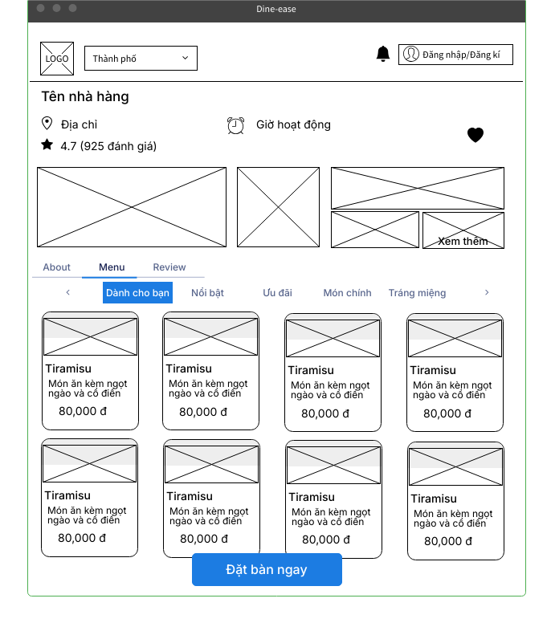

**3. UC_CUSTOMER_03: Đánh giá nhà hàng**
| Trường thông tin | Nội dung |
| :--- | :--- |
| **Use case Id** | UC_CUSTOMER_03 |
| **Name** (Tên use case) | Đánh giá nhà hàng |
| **Description** (Mô tả) | Use case này cho phép Khách hàng để lại nhận xét (bằng chữ) và chấm điểm (số sao) cho một nhà hàng sau khi họ đã hoàn thành việc đặt bàn và dùng bữa tại đó. Khách hàng cũng có thể đính kèm hình ảnh thực tế để minh họa cho đánh giá của mình. |
| **Primary Actor** (Actor chính) | Khách hàng (End User) |
| **Secondary Actor** (Actor phụ) | Hệ thống Cơ sở dữ liệu (PostgreSQL/MySQL) Cloudinary (Dịch vụ lưu trữ hình ảnh) |
| **Pre-conditions** (Tiền điều kiện) | 1. Khách hàng đã đăng nhập vào hệ thống. 2. Khách hàng có ít nhất một đơn đặt bàn tại nhà hàng đó ở trạng thái **"Đã hoàn thành" (Completed)**. 3. Khách hàng chưa từng đánh giá cho mã đơn đặt bàn (Reservation ID) này trước đó. |
| **Post-conditions** (Hậu điều kiện) | **Thành công:** 1. Bản ghi đánh giá (Review) được lưu vào CSDL. 2. Hình ảnh (nếu có) được tải lên Cloudinary và lưu URL vào CSDL. 3. Điểm đánh giá trung bình (Rating Score) của nhà hàng được hệ thống tính toán và cập nhật lại.  **Thất bại:** 1. Không có đánh giá nào được lưu. 2. Hệ thống hiển thị thông báo lỗi cụ thể. |
| **Main flows** (Luồng hoạt động chính) | 1. Use case bắt đầu khi Khách hàng truy cập vào mục "Lịch sử đặt bàn" hoặc nhận được thông báo nhắc nhở đánh giá từ hệ thống. 2. Khách hàng nhấn nút **"Đánh giá"** tại một đơn đặt bàn đã hoàn thành. 3. Hệ thống hiển thị Form đánh giá bao gồm: Chọn số sao (từ 1 đến 5 sao), Ô nhập nội dung nhận xét, và Nút đính kèm ảnh. 4. Khách hàng chọn số sao (Ví dụ: 5 sao) và nhập nội dung nhận xét (Ví dụ: "Đồ ăn rất ngon, phục vụ nhiệt tình"). 5. Khách hàng nhấn nút **"Gửi đánh giá"**. 6. Hệ thống (Frontend) kiểm tra tính hợp lệ: Số sao là bắt buộc (không được để trống). 7. Ứng dụng gửi yêu cầu chứa dữ liệu đánh giá và `reservation_id` xuống Backend. 8. Backend kiểm tra lại điều kiện (đơn đặt bàn đã hoàn thành và chưa bị đánh giá trùng lặp). 9. Backend lưu bản ghi Review vào CSDL và kích hoạt trigger tính lại điểm trung bình của nhà hàng. 10. Backend trả về phản hồi thành công. 11. Hệ thống hiển thị thông báo: *"Cảm ơn bạn đã gửi đánh giá!"* và ẩn nút "Đánh giá" của đơn đặt bàn đó. 12. Use case kết thúc. |
| **Alternative flows** (Luồng thay thế) | **4a. Khách hàng tải lên hình ảnh :** 1. Tại bước 4, Khách hàng nhấn nút **"Đính kèm ảnh"**. 2. Khách hàng chọn một hoặc nhiều bức ảnh từ thiết bị (điện thoại/máy tính). 3. Frontend hiển thị bản xem trước (preview) của các bức ảnh vừa chọn. Khách hàng có thể nhấn nút (X) để xóa ảnh nếu chọn nhầm. 4. Tại bước 7, Frontend đóng gói dữ liệu chữ kèm theo các file ảnh gửi lên Backend. 5. Backend nhận yêu cầu, gọi API của **Actor Cloudinary** để tải các file ảnh này lên đám mây. 6. Cloudinary xử lý, lưu trữ và trả về các đường dẫn URL an toàn của hình ảnh. 7. Backend lưu bản ghi Review cùng với danh sách URL hình ảnh vào CSDL. 8. Luồng hoạt động tiếp tục tại Bước 9.  **2a. Khách hàng cố tình đánh giá đơn hàng chưa hoàn thành:** 1. Tại bước 2, nếu Khách hàng bằng cách nào đó (sửa URL) truy cập vào link đánh giá của một đơn đặt bàn đang ở trạng thái "Chờ xác nhận" hoặc "Đã hủy". 2. Backend kiểm tra trạng thái đơn hàng và phát hiện vi phạm luồng nghiệp vụ. 3. Backend trả về mã lỗi `403 Forbidden`. 4. Frontend chuyển hướng khách hàng về trang Lịch sử và hiển thị thông báo: *"Bạn chỉ có thể đánh giá nhà hàng sau khi đã dùng bữa thành công."* 5. Use case kết thúc. |
| **Exception flows** (Luồng ngoại lệ) | **5a (Luồng 4a). Lỗi dịch vụ Cloudinary:** 1. Tại bước 5 của luồng 4a, khi Backend gọi API của Cloudinary để tải ảnh lên, dịch vụ Cloudinary bị sập hoặc mạng chập chờn dẫn đến Timeout. 2. Backend bắt lỗi (catch exception), hủy bỏ toàn bộ giao dịch lưu đánh giá (Rollback) để tránh việc có chữ mà mất ảnh. 3. Backend trả về mã lỗi `502 Bad Gateway` hoặc `500 Internal Server Error`. 4. Frontend hiển thị thông báo lỗi: *"Hệ thống tải ảnh đang gặp sự cố. Vui lòng thử lại sau ít phút hoặc gửi đánh giá không kèm ảnh."* 5. Khách hàng có thể quyết định xóa ảnh đi và nhấn gửi lại.  **7a. Lỗi dữ liệu độc hại (XSS / Spam Injection):** 1. Tại bước 7, Khách hàng (hoặc Bot) cố tình chèn các đoạn mã script độc hại (``) vào ô nội dung nhận xét. 2. Backend (thông qua bộ lọc Sanitization) phát hiện nội dung chứa ký tự nguy hiểm không kiểm soát được. 3. Backend chặn việc lưu CSDL và trả về mã `400 Bad Request`. 4. Frontend hiển thị cảnh báo: *"Nội dung đánh giá chứa ký tự không hợp lệ. Vui lòng kiểm tra lại."* 5. Use case kết thúc thất bại.  **9a. Lỗi mất kết nối Cơ sở dữ liệu (Database Error):** 1. Tại bước 9, Backend không thể lưu bản ghi vào PostgreSQL/MySQL do CSDL bị sập. 2. Backend trả về mã `500 Internal Server Error`. 3. Frontend hiển thị thông báo: *"Hệ thống đang bận, không thể gửi đánh giá lúc này."* |

---

*Wireframe tương ứng:*
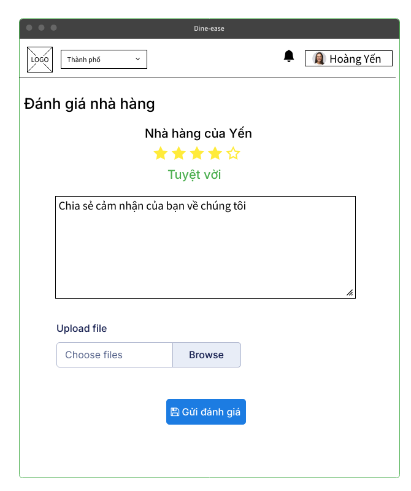

**4. UC_CUSTOMER_04: Xem lịch sử đặt bàn**
| Trường thông tin | Nội dung |
| :--- | :--- |
| **Use case Id** | UC_CUSTOMER_04 |
| **Name** (Tên use case) | Xem lịch sử đặt bàn |
| **Description** (Mô tả) | Use case này cho phép Khách hàng xem lại toàn bộ danh sách các đơn đặt bàn của mình (bao gồm cả quá khứ và sắp tới). Khách hàng bắt buộc phải xem được chi tiết trạng thái của từng đơn. Tùy thuộc vào trạng thái đó, khách hàng có thể thực hiện các hành động mở rộng như Hủy lịch (nếu chưa ăn) hoặc Đặt lại (nếu đã ăn/đã hủy). |
| **Primary Actor** (Actor chính) | Khách hàng (End User) |
| **Secondary Actor** (Actor phụ) | Hệ thống Cơ sở dữ liệu (PostgreSQL/MySQL) |
| **Pre-conditions** (Tiền điều kiện) | 1. Khách hàng đã đăng nhập thành công vào hệ thống (App/Web). |
| **Post-conditions** (Hậu điều kiện) | **Thành công:** 1. Khách hàng xem được danh sách đặt bàn và trạng thái chính xác của chúng. 2. Các thao tác mở rộng (Hủy/Đặt lại) được thực thi thành công nếu khách hàng yêu cầu.  **Thất bại:** 1. Hệ thống không tải được dữ liệu và hiển thị thông báo lỗi. |
| **Main flows** (Luồng hoạt động chính) | 1. Use case bắt đầu khi Khách hàng nhấn vào mục "Lịch sử" hoặc "Đơn đặt bàn của tôi" trên thanh điều hướng. 2. Ứng dụng (Frontend) gửi yêu cầu kèm theo Token xác thực của Khách hàng xuống Backend. 3. Backend xác thực Token, trích xuất `user_id` và truy vấn CSDL để lấy toàn bộ danh sách đặt bàn của user này, sắp xếp theo thời gian (mới nhất xếp trước). 4. Backend trả dữ liệu về cho Frontend dưới dạng JSON. 5. Frontend nhận dữ liệu và hiển thị danh sách các đơn đặt bàn. 6. : Tại mỗi thẻ (card) đơn đặt bàn, hệ thống bắt buộc hiển thị rõ ràng **Trạng thái hiện tại** (Ví dụ:  Chờ xác nhận,  Đã xác nhận,  Đã hoàn thành, Đã hủy) kèm theo các thông tin chi tiết: Tên nhà hàng, Ngày giờ đến, Số lượng khách, Tiền cọc. 7. Khách hàng có thể cuộn để xem toàn bộ lịch sử của mình. 8. Use case kết thúc. |
| **Alternative flows** (Luồng thay thế) | **6a. Khách hàng muốn hủy lịch:** 1. Tại bước 6, đối với các đơn đang ở trạng thái "Chờ xác nhận" hoặc "Đã xác nhận", hệ thống hiển thị thêm nút **"Hủy đặt bàn"**. 2. Khách hàng nhấn nút "Hủy đặt bàn". 3. Hệ thống hiển thị Dialog xác nhận: *"Bạn có chắc chắn muốn hủy lịch hẹn này? (Tiền cọc có thể không được hoàn lại tùy theo chính sách nhà hàng)"*. 4. Khách hàng nhấn "Đồng ý". 5. Backend cập nhật trạng thái đơn thành `CANCELLED` và giải phóng bàn cho nhà hàng. 6. Hệ thống tải lại danh sách (Quay lại Bước 2).  **6b. Khách hàng muốn đặt lại:** 1. Tại bước 6, đối với các đơn ở trạng thái "Đã hoàn thành" hoặc "Đã hủy", hệ thống hiển thị thêm nút **"Đặt lại" (Rebook)**. 2. Khách hàng nhấn nút "Đặt lại". 3. Hệ thống trích xuất `restaurant_id` từ đơn cũ và tự động chuyển hướng khách hàng sang màn hình "Đặt bàn online" của chính nhà hàng đó. 4. Use case kết thúc (chuyển sang luồng Đặt bàn).  **3a. Lịch sử trống (Khách hàng chưa từng đặt bàn):** 1. Tại bước 3, Backend truy vấn nhưng Khách hàng này chưa có bất kỳ đơn đặt bàn nào trong CSDL. 2. Backend trả về mảng rỗng `[]`. 3. Frontend hiển thị giao diện trạng thái trống (Empty State) với thông báo: *"Bạn chưa có lịch sử đặt bàn nào."* kèm theo một nút **"Khám phá nhà hàng ngay"**. 4. Khách hàng nhấn nút và được chuyển hướng về Trang chủ để tìm kiếm. 5. Use case kết thúc. |
| **Exception flows** (Luồng ngoại lệ) | **5a (Luồng 6a). Cố tình hủy đơn không hợp lệ (Bypass UI / API Hacking):** 1. Tại bước 5 của luồng 6a, Khách hàng (hoặc bot) dùng công cụ can thiệp API để gửi lệnh "Hủy" cho một đơn đặt bàn **đã quá giờ cho phép hủy** (Ví dụ: sát giờ ăn) hoặc đơn **đã Hoàn thành**. 2. Backend kiểm tra logic nghiệp vụ (Validation) và phát hiện hành vi không hợp lệ. 3. Backend chặn thao tác cập nhật CSDL và trả về mã lỗi `403 Forbidden` hoặc `400 Bad Request`. 4. Frontend hiển thị thông báo lỗi: *"Thao tác không hợp lệ. Đơn đặt bàn này không thể hủy vào lúc này."* 5. Use case kết thúc thất bại.  **3b. Lỗi mất kết nối Cơ sở dữ liệu (Database Error):** 1. Tại bước 3, Backend không thể kết nối tới PostgreSQL/MySQL do máy chủ CSDL bị sập hoặc quá tải. 2. Backend bắt lỗi (catch exception) và trả về mã `500 Internal Server Error`. 3. Frontend hiển thị thông báo lỗi: *"Hệ thống đang bận, không thể tải lịch sử đặt bàn. Vui lòng vuốt xuống để thử lại."* 4. Use case kết thúc thất bại. |

---

*Wireframe tương ứng:*
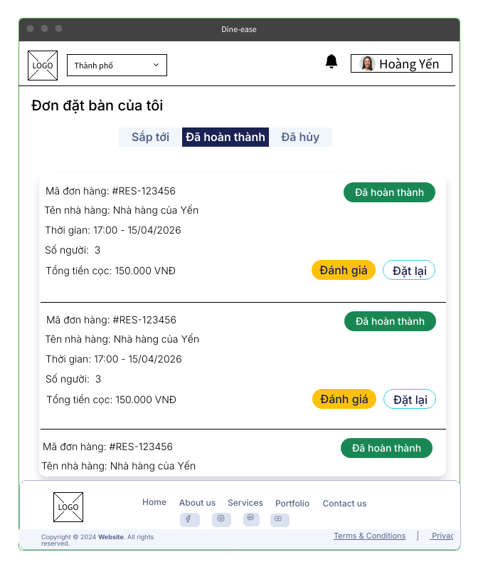

**5. UC_CUSTOMER_05: Đặt bàn online**
| Trường thông tin | Nội dung |
| :--- | :--- |
| **Use case Id** | UC_CUSTOMER_05 |
| **Name** (Tên use case) | Đặt bàn online |
| **Description** (Mô tả) | Use case này cho phép Khách hàng thực hiện quy trình đặt chỗ trước tại một nhà hàng. Khách hàng chọn ngày, giờ, số lượng người. Hệ thống bắt buộc phải kiểm tra tình trạng bàn trống. Khách hàng có thể tùy chọn vị trí ngồi, để lại ghi chú, và thực hiện thanh toán tiền cọc (nếu nhà hàng yêu cầu). Cuối cùng, hệ thống sẽ gửi thông báo xác nhận. |
| **Primary Actor** (Actor chính) | Khách hàng (End User) |
| **Secondary Actor** (Actor phụ) | Hệ thống Cơ sở dữ liệu (PostgreSQL/MySQL) Cổng thanh toán (Momo) Hệ thống gửi Email (EmailSystem) |
| **Pre-conditions** (Tiền điều kiện) | 1. Khách hàng đang ở trang "Chi tiết nhà hàng". 2. Khách hàng đã đăng nhập vào hệ thống (để xác danh tính và liên hệ). |
| **Post-conditions** (Hậu điều kiện) | **Thành công:** 1. Bản ghi Đặt bàn (Reservation) được tạo trong CSDL với trạng thái `PENDING` (Chờ xác nhận) hoặc `CONFIRMED` (Đã xác nhận nếu có cọc). 2. Email thông báo được gửi đến Khách hàng.  **Thất bại:** 1. Không có bản ghi nào được tạo. 2. Hệ thống hiển thị thông báo lỗi (Hết bàn, lỗi thanh toán...). |
| **Main flows** (Luồng hoạt động chính) | 1. Use case bắt đầu khi Khách hàng nhấn nút **"Đặt bàn ngay"** tại trang chi tiết nhà hàng. 2. Hệ thống hiển thị Form đặt bàn yêu cầu nhập: Ngày đến, Giờ đến, Số lượng người lớn/trẻ em. 3. Khách hàng điền thông tin và nhấn "Tiếp tục". 4.: Ứng dụng gửi yêu cầu xuống Backend. Backend truy vấn CSDL để đối chiếu số lượng bàn trống của nhà hàng tại khung giờ đó với số lượng khách. 5. Backend xác nhận còn bàn trống và trả về kết quả hợp lệ. 6. Hệ thống hiển thị màn hình Điền thông tin liên hệ (Tên, SĐT - tự động điền từ profile). 7. Khách hàng kiểm tra thông tin và nhấn **"Xác nhận đặt bàn"**. 8. Backend tạo bản ghi Reservation mới trong CSDL với trạng thái `PENDING`. 9: Backend gọi **Actor EmailSystem** để gửi một email "Yêu cầu đặt bàn đã được ghi nhận" đến Khách hàng. 10. Hệ thống hiển thị màn hình "Đặt bàn thành công" kèm mã đơn hàng. 11. Use case kết thúc. |
| **Alternative flows** (Luồng thay thế ) | **4a. Hết bàn trống (Xử lý khi Kiểm tra khả dụng thất bại:** 1. Tại bước 4, Backend phát hiện khung giờ Khách hàng chọn đã kín bàn. 2. Backend trả về danh sách các khung giờ trống gần nhất (Ví dụ: Trễ hơn 30 phút hoặc sớm hơn 1 tiếng). 3. Frontend hiển thị thông báo: *"Khung giờ này đã hết bàn. Vui lòng chọn các khung giờ gợi ý dưới đây."* 4. Khách hàng chọn một khung giờ gợi ý mới. 5. Luồng hoạt động tiếp tục tại Bước 5.  **6a. Khách hàng thêm yêu cầu đặc biệt:** 1. Tại bước 6, Khách hàng nhấn vào mục "Yêu cầu thêm". 2. Khách hàng chọn Vị trí mong muốn từ dropdown (Ví dụ: Cạnh cửa sổ, Phòng VIP, Ngoài trời). 3. Khách hàng nhập Ghi chú (Ví dụ: "Setup bàn tiệc sinh nhật, có người dị ứng đậu phộng"). 4. Tại bước 8, Backend lưu các thông tin vị trí và ghi chú này kèm theo bản ghi Reservation. 5. Luồng hoạt động tiếp tục tại Bước 9.  **7a. Nhà hàng yêu cầu đặt cọc:** 1. Tại bước 7, hệ thống nhận diện nhà hàng này có cấu hình "Bắt buộc đặt cọc" (Ví dụ: 200.000 VNĐ). 2. Khách hàng nhấn "Thanh toán & Đặt bàn". 3. Hệ thống tạo bản ghi Reservation với trạng thái `AWAITING_PAYMENT` (Chờ thanh toán). 4. Hệ thống chuyển hướng Khách hàng sang cổng thanh toán của **Actor Momo**. 5. Khách hàng thực hiện quét mã QR/thanh toán trên Momo thành công. 6. Momo gửi IPN (Webhook) về Backend. Backend cập nhật trạng thái đơn thành `CONFIRMED` (Đã xác nhận). 7. Luồng hoạt động tiếp tục tại Bước 9. |
| **Exception flows** (Luồng ngoại lệ) | **4b. Xung đột đặt bàn đồng thời:** 1. Tại bước 4, hệ thống báo còn 1 bàn trống. Tuy nhiên, tại bước 8, khi Khách hàng A nhấn "Xác nhận", một Khách hàng B khác đã nhanh tay bấm xác nhận trước đó vài mili-giây và lấy mất bàn cuối cùng. 2. Backend (thông qua cơ chế Database Locking / Transaction) phát hiện xung đột và từ chối lưu bản ghi của Khách hàng A. 3. Backend trả về mã lỗi `409 Conflict`. 4. Frontend hiển thị thông báo: *"Rất tiếc, bàn cuối cùng vừa được người khác đặt. Vui lòng chọn lại khung giờ."* 5. Use case kết thúc thất bại.  **7b (Luồng 7a). Lỗi Cổng thanh toán Momo (Payment Gateway Timeout):** 1. Tại bước 4 của luồng 7a, hệ thống Momo bị sập hoặc mất kết nối mạng. 2. Khách hàng không thể thanh toán, hoặc thanh toán bị treo. 3. Sau 15 phút không nhận được IPN từ Momo, một tác vụ nền (Background Job) của Backend tự động hủy đơn đặt bàn. 4. Backend cập nhật trạng thái thành `CANCELLED` và gọi EmailSystem báo cho khách hàng: *"Đơn đặt bàn bị hủy do quá hạn thanh toán."*  **8a. Lỗi dữ liệu độc hại (Bypass Validation):** 1. Tại bước 8, Khách hàng (hoặc Bot) dùng tool can thiệp API, gửi số lượng người là số âm (`-5` người) hoặc ngày đặt bàn trong quá khứ. 2. Backend phát hiện dữ liệu phi logic. 3. Backend chặn lưu CSDL, trả về lỗi `400 Bad Request`. 4. Frontend hiển thị: *"Dữ liệu không hợp lệ. Vui lòng thử lại."* |

---

*Wireframe tương ứng:*
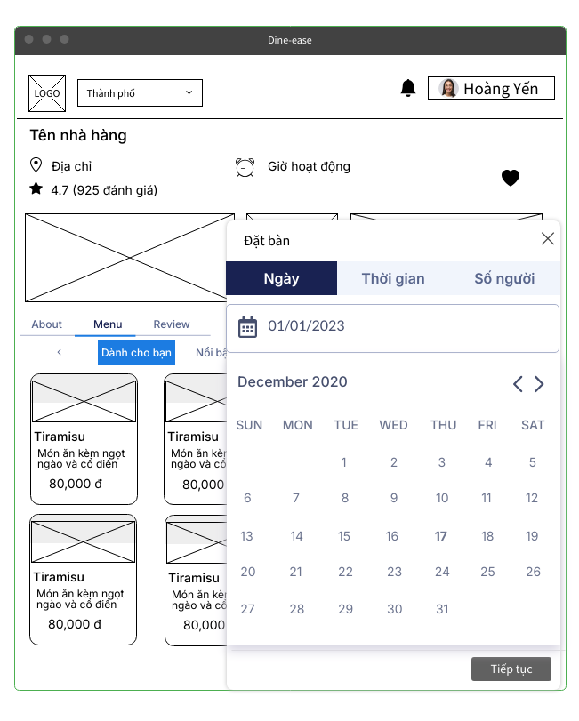

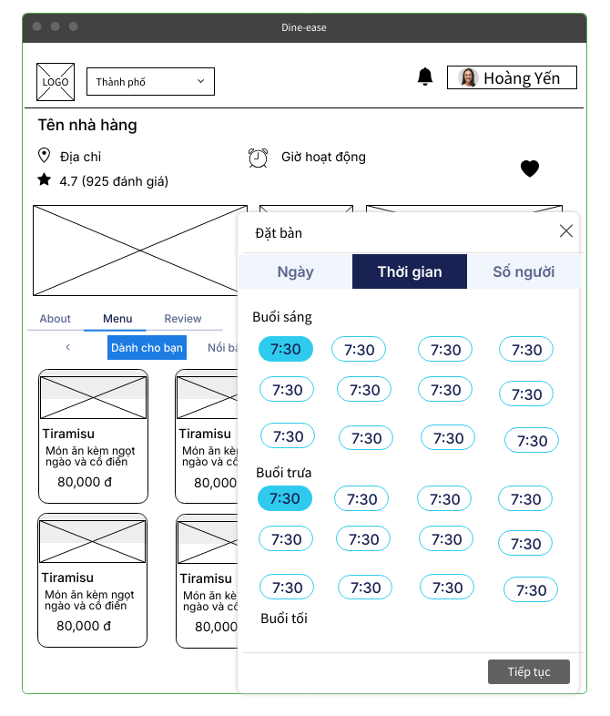

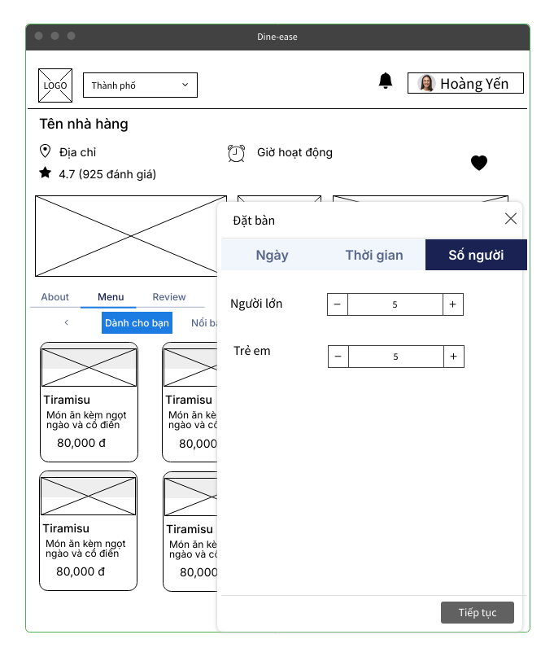

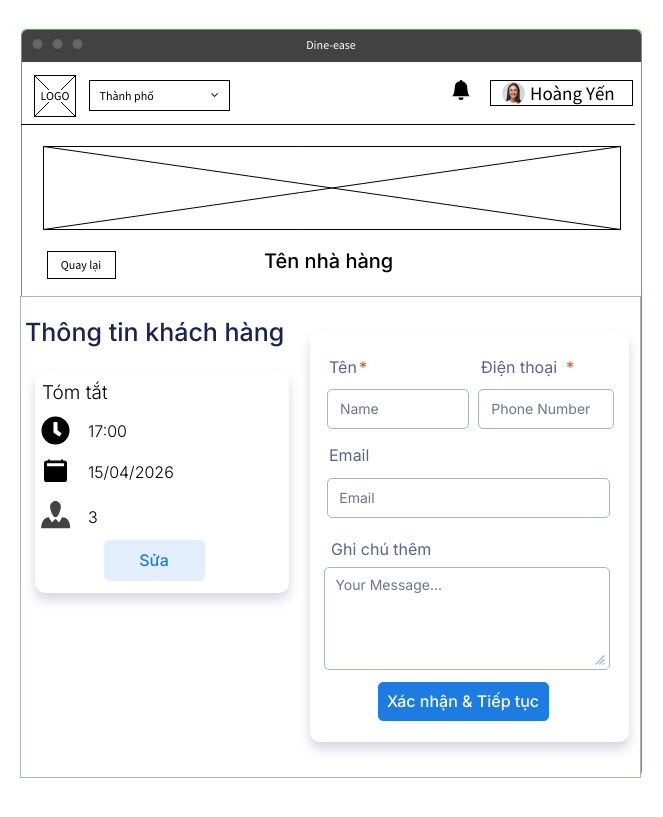

**6. UC_CUSTOMER_06: Thanh toán đặt cọc**
| Trường thông tin | Nội dung |
| :--- | :--- |
| **Use case Id** | UC_CUSTOMER_06 |
| **Name** (Tên use case) | Thanh toán đặt cọc |
| **Description** (Mô tả) | Use case này mô tả quy trình Khách hàng thanh toán một khoản tiền cọc để giữ chỗ cho đơn đặt bàn của mình. Khách hàng có thể áp dụng mã giảm giá (Voucher) để giảm số tiền cần thanh toán. Hệ thống bắt buộc phải chuyển hướng khách hàng sang cổng thanh toán điện tử (Momo) để xử lý giao dịch an toàn. |
| **Primary Actor** (Actor chính) | Khách hàng (End User) |
| **Secondary Actor** (Actor phụ) | Hệ thống Cơ sở dữ liệu (PostgreSQL/MySQL) Cổng thanh toán (Momo) |
| **Pre-conditions** (Tiền điều kiện) | 1. Khách hàng đang trong luồng "Đặt bàn online" và đã xác nhận thông tin đặt bàn. 2. Nhà hàng được chọn có thiết lập chính sách "Bắt buộc đặt cọc" (Ví dụ: Cọc 200k/bàn hoặc cọc 20% tổng bill dự kiến). 3. Đơn đặt bàn (Reservation) đã được tạo tạm trong CSDL với trạng thái `AWAITING_PAYMENT` (Chờ thanh toán). |
| **Post-conditions** (Hậu điều kiện) | **Thành công:** 1. Giao dịch thanh toán được ghi nhận thành công trong CSDL. 2. Trạng thái đơn đặt bàn chuyển sang `CONFIRMED` (Đã xác nhận).  **Thất bại:** 1. Giao dịch không thành công. 2. Đơn đặt bàn giữ nguyên trạng thái chờ thanh toán hoặc bị hệ thống tự động hủy (`CANCELLED`) nếu quá hạn. |
| **Main flows** (Luồng hoạt động chính) | 1. Use case bắt đầu khi Khách hàng nhấn "Xác nhận & Thanh toán" ở bước cuối của luồng Đặt bàn. 2. Hệ thống hiển thị màn hình Thanh toán, tóm tắt: Thông tin đơn hàng, Số tiền cọc cần thanh toán, và Phương thức thanh toán (Mặc định chọn Momo). 3. Khách hàng kiểm tra thông tin và nhấn nút **"Thanh toán ngay"**. 4: Backend tạo một mã giao dịch nội bộ (Transaction ID) và gửi yêu cầu tạo URL thanh toán sang API của **Actor Momo**. 5. Momo trả về một Payment URL. Frontend chuyển hướng (redirect) Khách hàng sang trang thanh toán an toàn của Momo (hoặc mở app Momo qua deep link). 6. Khách hàng thực hiện quét mã QR hoặc xác nhận thanh toán trên ứng dụng Momo thành công. 7. Momo hiển thị thông báo thành công và tự động chuyển hướng Khách hàng quay lại màn hình "Kết quả giao dịch" của ứng dụng nhà hàng. 8. Đồng thời (chạy ngầm), Momo gửi một IPN (Webhook) về Backend để báo cáo tiền đã vào tài khoản nhà hàng/nền tảng. 9. Backend đối chiếu chữ ký bảo mật (Signature), cập nhật trạng thái giao dịch thành `SUCCESS` và trạng thái đặt bàn thành `CONFIRMED`. 10. Frontend (sau khi polling/nhận kết quả từ Backend) hiển thị màn hình: *"Thanh toán đặt cọc thành công. Bàn của bạn đã được giữ!"* 11. Use case kết thúc. |
| **Alternative flows** (Luồng thay thế) | **2a. Khách hàng sử dụng Voucher:** 1. Tại bước 2, Khách hàng nhấn vào mục "Mã giảm giá / Voucher". 2. Khách hàng nhập mã (VD: `GIAM50K`) hoặc chọn từ danh sách voucher của mình. 3. Backend kiểm tra tính hợp lệ của mã (còn hạn, áp dụng cho nhà hàng này, đạt giá trị tối thiểu). 4. Nếu hợp lệ, hệ thống tính toán lại "Số tiền cọc cần thanh toán" (Trừ đi số tiền được giảm). 5. Frontend hiển thị số tiền mới. Luồng hoạt động tiếp tục tại Bước 3.  **6a. Khách hàng chủ động hủy thanh toán:** 1. Tại bước 5 hoặc 6, Khách hàng đổi ý, nhấn nút "Hủy giao dịch" hoặc "Quay lại" trên giao diện của Momo. 2. Momo chuyển hướng Khách hàng về lại ứng dụng với trạng thái hủy. 3. Frontend hiển thị thông báo: *"Thanh toán bị hủy. Đơn đặt bàn của bạn sẽ được giữ trong 15 phút để bạn thanh toán lại."* 4. Khách hàng có thể nhấn "Thanh toán lại" (Hệ thống tạo URL Momo mới - Quay lại Bước 4). |
| **Exception flows** (Luồng ngoại lệ) | **3a (Luồng 2a). Lỗi mã giảm giá không hợp lệ (Validation Error):** 1. Tại bước 3 của luồng 2a, Backend phát hiện mã giảm giá đã hết hạn, sai mã, hoặc không đủ điều kiện áp dụng. 2. Backend trả về lỗi `400 Bad Request`. 3. Frontend hiển thị thông báo chữ đỏ: *"Mã giảm giá không hợp lệ hoặc đã hết hạn."* 4. Khách hàng bắt buộc phải xóa mã hoặc nhập mã khác để tiếp tục thanh toán.  **4a. Lỗi Cổng thanh toán Momo (Payment Gateway Timeout/Down):** 1. Tại bước 4 (tạo URL) hoặc bước 8 (nhận IPN), hệ thống Momo không phản hồi hoặc báo lỗi `502 Bad Gateway` / `500 Internal Server Error`. 2. Backend ghi log lỗi hệ thống và trả về thông báo cho Frontend. 3. Frontend hiển thị: *"Cổng thanh toán đang bảo trì hoặc mất kết nối. Vui lòng thử lại sau ít phút."* 4. Use case kết thúc thất bại.  **8a. Quá hạn thanh toán (Payment Timeout Logic):** 1. Khách hàng ở lại trang Momo quá lâu (VD: > 15 phút) mà không thanh toán. 2. Một Cronjob (tác vụ nền) của Backend quét các đơn `AWAITING_PAYMENT` quá hạn. 3. Backend tự động cập nhật trạng thái đơn thành `CANCELLED` để giải phóng bàn cho khách khác. 4. Nếu khách hàng thanh toán thành công *sau* khi đơn đã bị hủy, Backend nhận IPN sẽ ghi nhận giao dịch là `REFUND_PENDING` (Cần hoàn tiền) và gửi cảnh báo cho Admin xử lý.  **9a. Giả mạo giao dịch (IPN Forgery / Security Threat):** 1. Tại bước 8, một kẻ tấn công (Hacker) giả mạo request IPN gửi đến Backend báo rằng "Đã thanh toán thành công 200k". 2. Backend tính toán lại chữ ký (Signature/Checksum) dựa trên Secret Key của Momo và phát hiện chữ ký không khớp. 3. Backend từ chối request ngay lập tức (`403 Forbidden`), không cập nhật trạng thái đơn. 4. Ghi log cảnh báo bảo mật (Security Alert). |

---

*Wireframe tương ứng:*
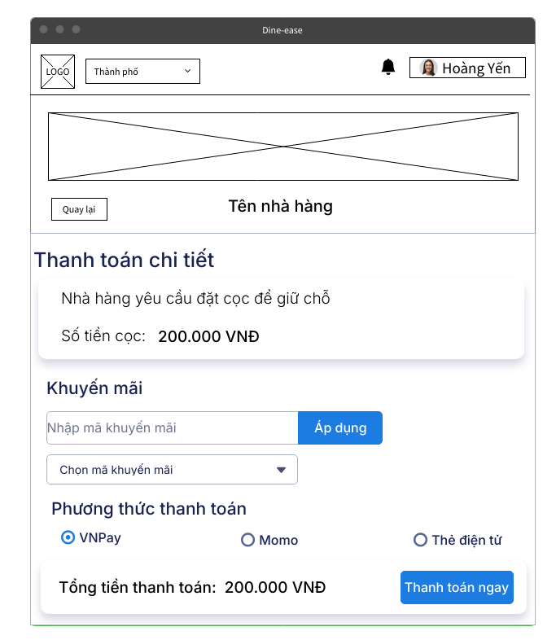

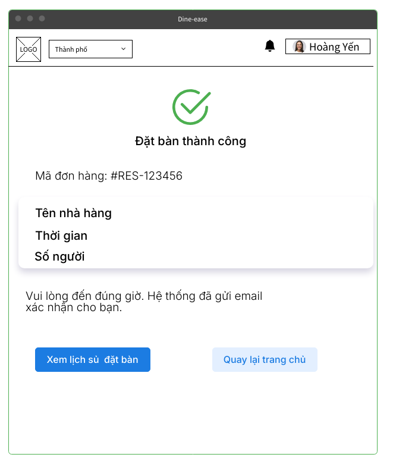

*Bổ sung các Wireframe khác:*

---

### 3.2. Phân hệ Quản trị viên (Admin)
#### 3.2.1. Sơ đồ Use Case Admin
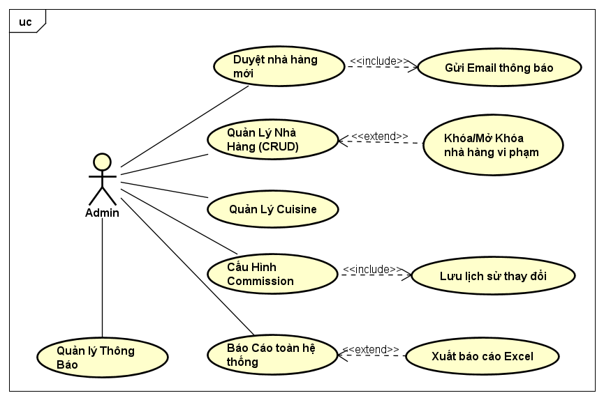

#### 3.2.2. Chi tiết Đặc tả & Wireframes
**1. UC_ADMIN_01: Duyệt nhà hàng mới**
| Trường thông tin | Nội dung |
| :--- | :--- |
| **Use case Id** | UC_ADMIN_01 |
| **Name** (Tên use case) | Duyệt nhà hàng mới |
| **Description** (Mô tả) | Use case này mô tả quy trình Quản trị viên (Admin) xem xét yêu cầu đăng ký mở gian hàng từ một đối tác Nhà hàng mới. Admin sẽ kiểm tra các thông tin pháp lý, hình ảnh, thực đơn dự kiến và đưa ra quyết định Phê duyệt (kèm thiết lập mức hoa hồng), Từ chối, hoặc Yêu cầu bổ sung thông tin. |
| **Primary Actor** (Actor chính) | Admin (Quản trị hệ thống) |
| **Secondary Actor** (Actor phụ) | Hệ thống gửi Email (Ví dụ: JavaMail / SendGrid) |
| **Pre-conditions** (Tiền điều kiện) | 1. Admin đã đăng nhập thành công vào hệ thống quản trị (Admin Dashboard). 2. Có ít nhất một yêu cầu đăng ký nhà hàng mới đang ở trạng thái chờ duyệt (`PENDING`) trong cơ sở dữ liệu. |
| **Post-conditions** (Hậu điều kiện) | **Thành công:** 1. Trạng thái của nhà hàng được cập nhật thành `APPROVED` (Đã duyệt) hoặc `REJECTED` (Từ chối) trong CSDL. 2. Mức chiết khấu (commission) được lưu lại (nếu duyệt). 3. Một email thông báo kết quả được gửi tự động đến chủ nhà hàng.  **Thất bại:** 1. Trạng thái của nhà hàng không thay đổi. 2. Hệ thống hiển thị thông báo lỗi cụ thể cho Admin. |
| **Main flows** (Luồng hoạt động chính) | 1. Use case bắt đầu khi Admin chọn mục "Quản lý đối tác" -> "Yêu cầu chờ duyệt" trên thanh điều hướng. 2. Hệ thống truy vấn CSDL và hiển thị danh sách các nhà hàng đang ở trạng thái `PENDING`. 3. Admin nhấn vào nút "Xem chi tiết" tại một nhà hàng cụ thể. 4. Hệ thống hiển thị giao diện chi tiết hồ sơ nhà hàng bao gồm: Thông tin chủ sở hữu, Giấy phép kinh doanh (file ảnh/PDF), Địa chỉ, Hình ảnh không gian, và Thực đơn dự kiến. 5. Admin kiểm tra tính hợp lệ của các thông tin và tài liệu. 6. Admin nhấn nút **"Phê duyệt"**. 7. Hệ thống hiển thị một Dialog (hộp thoại) yêu cầu Admin nhập **Mức hoa hồng (Commission %)** áp dụng cho nhà hàng này và xác nhận. 8. Admin nhập mức hoa hồng (ví dụ: 15%) và nhấn "Xác nhận duyệt". 9. Hệ thống gửi yêu cầu cập nhật (POST/PUT) xuống Backend. 10. Backend cập nhật trạng thái nhà hàng thành `APPROVED` và lưu mức hoa hồng vào CSDL. 11. Backend kích hoạt một tác vụ nền (background task) gọi đến Hệ thống gửi Email để gửi thư chúc mừng và hướng dẫn đăng nhập cho Chủ nhà hàng. 12. Hệ thống hiển thị thông báo "Đã phê duyệt nhà hàng thành công" và đưa Admin quay lại danh sách chờ duyệt (Bước 2). 13. Use case kết thúc. |
| **Alternative flows** (Luồng thay thế) | **6a. Admin quyết định Từ chối nhà hàng:** 1. Tại bước 6, Admin nhấn nút **"Từ chối"**. 2. Hệ thống hiển thị Dialog yêu cầu nhập "Lý do từ chối" (Bắt buộc). 3. Admin nhập lý do (ví dụ: Giấy phép kinh doanh mờ, không hợp lệ) và xác nhận. 4. Backend cập nhật trạng thái thành `REJECTED` và lưu lý do vào CSDL. 5. Backend gọi Hệ thống gửi Email để gửi thư thông báo từ chối kèm lý do cho Chủ nhà hàng. 6. Luồng hoạt động tiếp tục tại Bước 12.  **6b. Admin Yêu cầu bổ sung thông tin:** 1. Tại bước 6, Admin nhấn nút **"Yêu cầu bổ sung"**. 2. Hệ thống hiển thị Dialog yêu cầu nhập "Nội dung cần bổ sung". 3. Admin nhập nội dung (ví dụ: Cập nhật lại ảnh mặt tiền nhà hàng) và xác nhận. 4. Backend cập nhật trạng thái thành `UPDATE_REQUIRED`. 5. Backend gọi Hệ thống gửi Email thông báo cho Chủ nhà hàng vào cập nhật lại hồ sơ. 6. Luồng hoạt động tiếp tục tại Bước 12. |
| **Exception flows** (Luồng ngoại lệ) | **10a. Lỗi kết nối Cơ sở dữ liệu (Database Error):** 1. Tại bước 10 (hoặc bước 4 của luồng 6a/6b), nếu CSDL gặp sự cố (timeout, deadlock). 2. Backend bắt lỗi (catch exception), hủy bỏ giao dịch (rollback) để đảm bảo tính toàn vẹn dữ liệu. 3. Backend trả về mã lỗi 500 Internal Server Error. 4. Hệ thống hiển thị thông báo: *"Lỗi hệ thống: Không thể cập nhật trạng thái lúc này. Vui lòng thử lại sau."* 5. Use case kết thúc trong trạng thái thất bại.  **11a. Lỗi Hệ thống gửi Email (Email Service Down):** 1. Tại bước 11, tác vụ nền không thể kết nối với máy chủ SMTP (JavaMail lỗi). 2. Backend ghi log lỗi hệ thống (Error Logging) và đưa tác vụ gửi email vào hàng đợi để thử lại sau (Retry Queue). 3. Trạng thái nhà hàng **vẫn được lưu thành công** trong CSDL. 4. Hệ thống hiển thị thông báo cảnh báo (Warning) cho Admin: *"Đã duyệt nhà hàng thành công, nhưng hệ thống gửi email đang gián đoạn. Email sẽ được gửi lại sau."* 5. Luồng hoạt động tiếp tục tại Bước 12. |

*Wireframe tương ứng:*
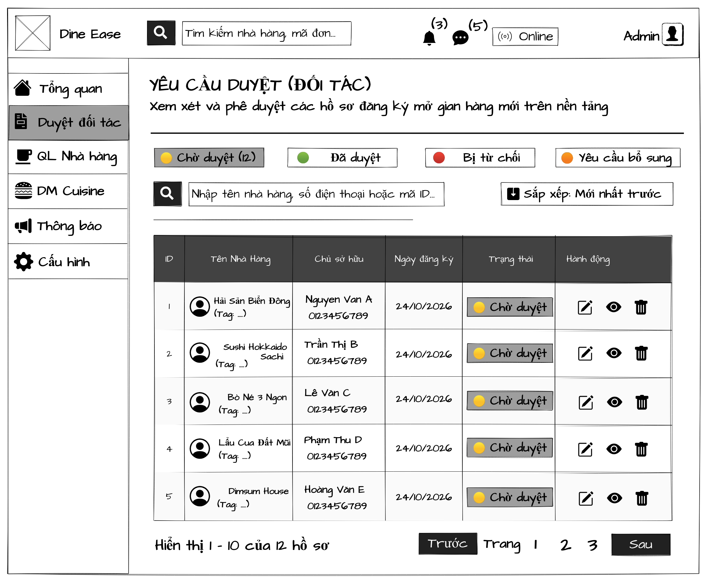
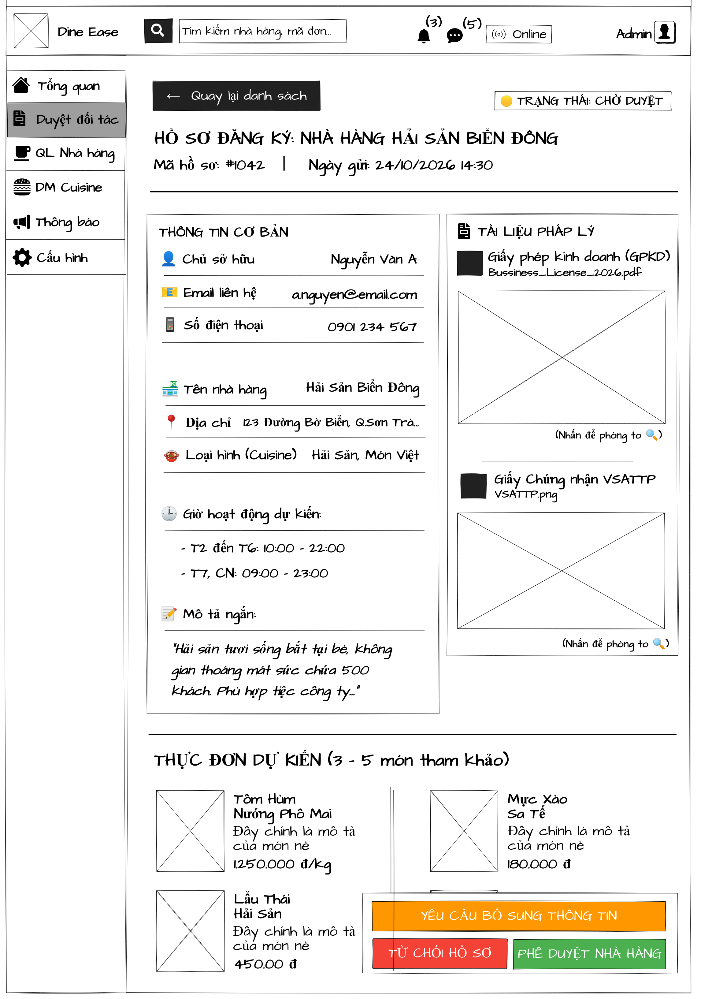

**2. UC_ADMIN_02: Quản lý nhà hàng (CRUD)**
| Trường thông tin | Nội dung |
| :--- | :--- |
| **Use case Id** | UC_ADMIN_02 |
| **Name** (Tên use case) | Quản lý nhà hàng (CRUD) |
| **Description** (Mô tả) | Use case này cho phép Quản trị viên (Admin) xem danh sách toàn bộ nhà hàng đang hoạt động trên nền tảng. Admin có thể tìm kiếm, lọc, xem chi tiết, thêm mới nhà hàng thủ công, cập nhật thông tin (trạng thái hoạt động, mức hoa hồng) và khóa/xóa tài khoản nhà hàng khi có vi phạm. |
| **Primary Actor** (Actor chính) | Admin (Quản trị hệ thống) |
| **Secondary Actor** (Actor phụ) | Hệ thống Cơ sở dữ liệu (PostgreSQL/MySQL) |
| **Pre-conditions** (Tiền điều kiện) | 1. Admin đã đăng nhập thành công vào hệ thống quản trị (Admin Dashboard). 2. Admin có quyền (Role/Permission) truy cập module "Quản lý nhà hàng". |
| **Post-conditions** (Hậu điều kiện) | **Thành công:** 1. Các thay đổi (Thêm/Sửa/Xóa) được lưu trữ thành công vào CSDL. 2. Giao diện danh sách nhà hàng được cập nhật dữ liệu mới nhất.  **Thất bại:** 1. CSDL không bị thay đổi (Rollback nếu có lỗi). 2. Hệ thống hiển thị thông báo lỗi rõ ràng cho Admin. |
| **Main flows** (Luồng hoạt động chính) | 1. Use case bắt đầu khi Admin chọn mục "Quản lý Nhà hàng" trên thanh menu điều hướng. 2. Hệ thống truy vấn CSDL và hiển thị danh sách tất cả các nhà hàng (phân trang), bao gồm các thông tin cơ bản: Tên, Chủ sở hữu, Trạng thái (Active/Inactive), Mức hoa hồng. 3. Admin nhấn vào nút **"Chỉnh sửa"** (hoặc Xem chi tiết) tại một nhà hàng cụ thể. 4. Hệ thống hiển thị form chi tiết chứa toàn bộ thông tin hiện tại của nhà hàng đó. 5. Admin tiến hành thay đổi thông tin (Ví dụ: Chỉnh sửa mức hoa hồng từ 15% lên 20%, hoặc thay đổi số điện thoại liên hệ). 6. Admin nhấn nút **"Lưu thay đổi"**. 7. Hệ thống (Frontend) kiểm tra tính hợp lệ của dữ liệu vừa nhập (Validate form). 8. Ứng dụng gửi yêu cầu (PUT/PATCH) kèm dữ liệu xuống Backend. 9. Backend cập nhật bản ghi tương ứng trong CSDL. 10. Hệ thống hiển thị thông báo "Cập nhật thông tin nhà hàng thành công" và quay lại màn hình danh sách (Bước 2). 11. Use case kết thúc. |
| **Alternative flows** (Luồng thay thế) | **2a. Tìm kiếm và Lọc nhà hàng (Read):** 1. Tại bước 2, Admin nhập từ khóa (Tên nhà hàng) vào ô tìm kiếm hoặc chọn bộ lọc (Trạng thái: Đang hoạt động, Cuisine: Món Âu). 2. Hệ thống truy vấn lại CSDL dựa trên tham số lọc và cập nhật lại danh sách hiển thị. 3. Luồng hoạt động tiếp tục tại Bước 3.  **2b. Thêm mới nhà hàng thủ công (Create):** 1. Tại bước 2, Admin nhấn nút **"Thêm nhà hàng mới"**. 2. Hệ thống hiển thị một form trống. 3. Admin điền các thông tin bắt buộc (Tên, Địa chỉ, SĐT, Mức hoa hồng...). 4. Admin nhấn "Lưu". 5. Backend tạo bản ghi mới trong CSDL và tự động tạo tài khoản đăng nhập (Business User) cho chủ nhà hàng. 6. Luồng hoạt động tiếp tục tại Bước 10.  **3a. Khóa/Xóa nhà hàng (Delete/Deactivate):** 1. Tại bước 3, Admin nhấn nút **"Khóa/Vô hiệu hóa"** (Soft delete) tại một nhà hàng vi phạm. 2. Hệ thống hiển thị Dialog xác nhận: *"Bạn có chắc chắn muốn vô hiệu hóa nhà hàng này? Các đặt bàn sắp tới có thể bị ảnh hưởng."* 3. Admin nhấn "Xác nhận". 4. Backend cập nhật trạng thái nhà hàng thành `INACTIVE` (Không xóa cứng để giữ lịch sử dữ liệu). 5. Luồng hoạt động tiếp tục tại Bước 10. |
| **Exception flows** (Luồng ngoại lệ) | **7a. Dữ liệu không hợp lệ từ phía Backend (Validation Error):** 1. Tại bước 8 (hoặc bước 4 của luồng 2b), nếu Admin nhập dữ liệu vi phạm ràng buộc CSDL (Ví dụ: Trùng số điện thoại đã tồn tại, hoặc mức hoa hồng nhập chữ thay vì số) mà Frontend lọt lưới. 2. Backend từ chối lưu và trả về mã lỗi `400 Bad Request`. 3. Hệ thống hiển thị thông báo lỗi màu đỏ ngay dưới trường dữ liệu bị sai (VD: *"Số điện thoại này đã được đăng ký cho nhà hàng khác"*). 4. Admin sửa lại dữ liệu và nhấn "Lưu" lần nữa.  **9a. Xung đột dữ liệu đồng thời (Concurrent Update Conflict):** 1. Tại bước 9, nếu có một Admin khác cũng đang chỉnh sửa và vừa lưu thành công thông tin của **cùng một nhà hàng** đó trước tích tắc. 2. Backend phát hiện phiên bản dữ liệu không khớp (Optimistic Locking). 3. Backend trả về mã lỗi `409 Conflict`. 4. Hệ thống hiển thị thông báo: *"Dữ liệu nhà hàng này vừa được cập nhật bởi một Quản trị viên khác. Vui lòng tải lại trang để xem thông tin mới nhất trước khi chỉnh sửa."* 5. Use case kết thúc thất bại, Admin phải F5 lại trang.  **9b. Mất kết nối Cơ sở dữ liệu:** 1. Tại bước 9, hệ thống không thể kết nối tới PostgreSQL/MySQL. 2. Backend trả về lỗi `500 Internal Server Error`. 3. Hệ thống hiển thị thông báo popup: *"Lỗi máy chủ: Không thể lưu dữ liệu lúc này. Vui lòng thử lại sau."* |

*Wireframe tương ứng:*
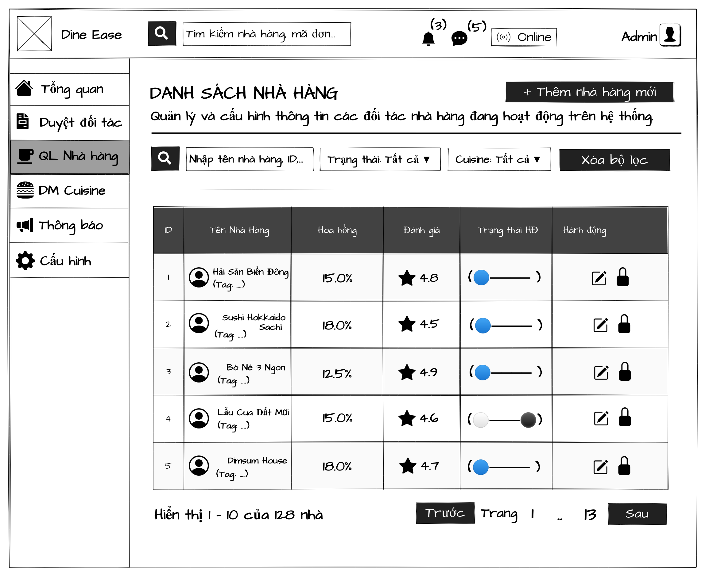
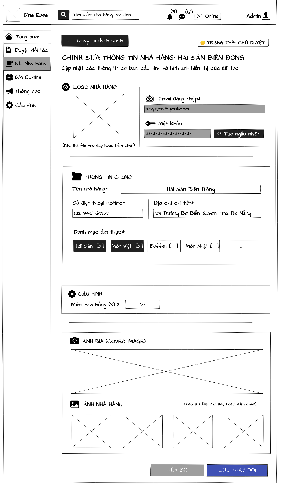

**3. UC_ADMIN_03: Quản lý danh mục cuisine**
| Trường thông tin | Nội dung |
| :--- | :--- |
| **Use case Id** | UC_ADMIN_03 |
| **Name** (Tên use case) | Quản lý danh mục cuisine (CRUD) |
| **Description** (Mô tả) | Use case này cho phép Quản trị viên (Admin) quản lý các danh mục ẩm thực (Cuisine Categories) trên hệ thống. Admin có thể xem danh sách, tìm kiếm, thêm mới, chỉnh sửa tên/hình ảnh đại diện, hoặc xóa các danh mục. Các danh mục này được dùng để nhà hàng tự phân loại và khách hàng sử dụng làm bộ lọc tìm kiếm. |
| **Primary Actor** (Actor chính) | Admin (Quản trị hệ thống) |
| **Secondary Actor** (Actor phụ) | Hệ thống Cơ sở dữ liệu (PostgreSQL/MySQL) Dịch vụ lưu trữ hình ảnh (Ví dụ: AWS S3 / Cloudinary - *nếu có upload icon*) |
| **Pre-conditions** (Tiền điều kiện) | 1. Admin đã đăng nhập thành công vào hệ thống quản trị. 2. Admin có quyền truy cập module "Cấu hình hệ thống" -> "Danh mục Cuisine". |
| **Post-conditions** (Hậu điều kiện) | **Thành công:** 1. CSDL được cập nhật với các danh mục cuisine mới hoặc đã chỉnh sửa. 2. Ứng dụng của Khách hàng và Nhà hàng lập tức nhận được danh sách danh mục mới nhất.  **Thất bại:** 1. Trạng thái CSDL giữ nguyên. 2. Hệ thống hiển thị thông báo lỗi giải thích lý do không thể lưu/xóa. |
| **Main flows** (Luồng hoạt động chính) | 1. Use case bắt đầu khi Admin chọn "Danh mục Cuisine" trên menu quản trị. 2. Hệ thống truy vấn CSDL và hiển thị danh sách các danh mục hiện có (Tên danh mục, Icon/Hình ảnh, Số lượng nhà hàng đang sử dụng). 3. Admin nhấn nút **"Chỉnh sửa"** tại một danh mục cụ thể (Ví dụ: "Món Nhật"). 4. Hệ thống hiển thị form chứa thông tin hiện tại của danh mục. 5. Admin thay đổi thông tin (Ví dụ: Đổi tên thành "Ẩm thực Nhật Bản", tải lên icon mới). 6. Admin nhấn nút **"Lưu thay đổi"**. 7. Hệ thống (Frontend) kiểm tra tính hợp lệ (không được để trống tên). 8. Ứng dụng gửi yêu cầu (PUT/PATCH) xuống Backend. 9. Backend cập nhật bản ghi trong CSDL (và upload icon mới lên Cloudinary nếu có). 10. Hệ thống hiển thị thông báo: *"Cập nhật danh mục thành công"* và tải lại danh sách (Bước 2). 11. Use case kết thúc. |
| **Alternative flows** (Luồng thay thế) | **2a. Thêm mới danh mục (Create):** 1. Tại bước 2, Admin nhấn nút **"Thêm danh mục mới"**. 2. Hệ thống hiển thị form trống. 3. Admin nhập Tên danh mục (VD: "Đồ ăn kiêng") và tải lên Icon. 4. Admin nhấn "Lưu". 5. Backend tạo bản ghi mới trong CSDL. 6. Luồng hoạt động tiếp tục tại Bước 10.  **3a. Xóa danh mục (Delete):** 1. Tại bước 3, Admin nhấn nút **"Xóa"** tại một danh mục **chưa có nhà hàng nào sử dụng** (Số lượng = 0). 2. Hệ thống hiển thị Dialog: *"Bạn có chắc chắn muốn xóa danh mục này vĩnh viễn?"*. 3. Admin nhấn "Xác nhận". 4. Backend thực hiện lệnh DELETE trong CSDL. 5. Luồng hoạt động tiếp tục tại Bước 10. |
| **Exception flows** (Luồng ngoại lệ) | **3b. Lỗi Ràng buộc Khóa ngoại (Foreign Key Constraint) khi Xóa:** 1. Tại bước 3 của luồng 3a, Admin cố tình nhấn "Xóa" một danh mục **đang có nhà hàng sử dụng** (VD: Xóa "Món Việt" đang có 50 nhà hàng gắn tag). 2. Backend thực hiện lệnh DELETE nhưng bị CSDL từ chối do vi phạm khóa ngoại (Cuisine_ID đang tồn tại trong bảng Restaurant). 3. Backend bắt lỗi (catch exception) và trả về mã `409 Conflict` hoặc `400 Bad Request`. 4. Hệ thống hiển thị thông báo lỗi màu đỏ: *"Không thể xóa! Danh mục này đang được sử dụng bởi 50 nhà hàng. Vui lòng chuyển đổi danh mục cho các nhà hàng đó trước khi xóa."* 5. Use case kết thúc thất bại.  **8a. Lỗi Trùng lặp tên danh mục (Unique Constraint):** 1. Tại bước 8 (hoặc bước 4 của luồng 2a), Admin nhập tên danh mục đã tồn tại trong hệ thống (VD: Tạo mới danh mục "Hải sản" trong khi đã có "Hải sản"). 2. Backend kiểm tra CSDL và phát hiện vi phạm ràng buộc Unique. 3. Backend trả về lỗi. 4. Hệ thống hiển thị cảnh báo: *"Tên danh mục này đã tồn tại. Vui lòng chọn tên khác."* 5. Admin phải sửa lại tên và thử lưu lại.  **9a. Lỗi dịch vụ lưu trữ ảnh (Cloudinary/S3 Down):** 1. Tại bước 9, Admin có tải lên Icon mới nhưng dịch vụ lưu trữ ảnh bên thứ 3 bị lỗi timeout. 2. Backend hủy bỏ giao dịch lưu CSDL (Rollback) để tránh việc có data nhưng mất ảnh. 3. Hệ thống thông báo: *"Lỗi tải ảnh lên máy chủ. Vui lòng kiểm tra lại file ảnh hoặc thử lại sau."* |

*Wireframe tương ứng:*
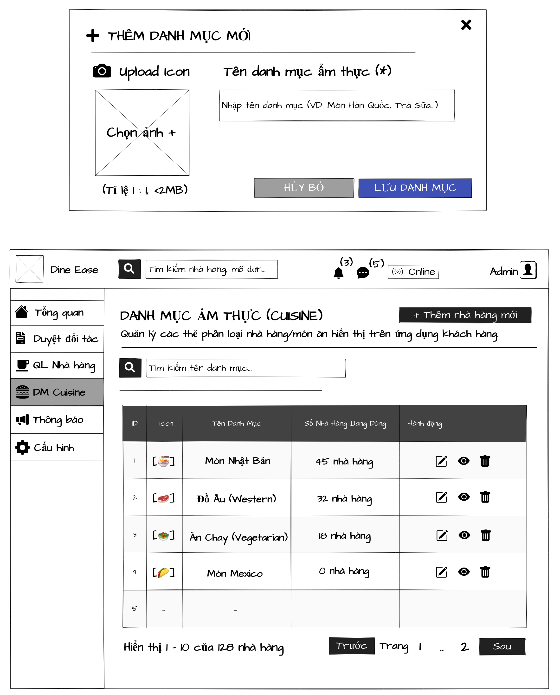

**4. UC_ADMIN_04: Cấu hình commission**
| Trường thông tin | Nội dung |
| :--- | :--- |
| **Use case Id** | UC_ADMIN_04 |
| **Name** (Tên use case) | Cấu hình commission (Mức hoa hồng) |
| **Description** (Mô tả) | Use case này cho phép Quản trị viên cấp cao (Super Admin) thiết lập và thay đổi mức phần trăm hoa hồng (Commission Rate) mặc định mà nền tảng sẽ thu từ các nhà hàng trên mỗi đơn đặt bàn thành công. Hệ thống sẽ lưu lại lịch sử thay đổi để phục vụ đối soát doanh thu. Mức cấu hình này sẽ áp dụng cho các nhà hàng mới đăng ký hoặc các nhà hàng đang sử dụng mức mặc định. |
| **Primary Actor** (Actor chính) | Super Admin (Quản trị viên cấp cao) |
| **Secondary Actor** (Actor phụ) | Hệ thống Cơ sở dữ liệu (PostgreSQL/MySQL) |
| **Pre-conditions** (Tiền điều kiện) | 1. Admin đã đăng nhập thành công vào hệ thống quản trị. 2. Admin phải có quyền hạn cao nhất (`ROLE_SUPER_ADMIN`) mới được phép truy cập module "Cấu hình tài chính". |
| **Post-conditions** (Hậu điều kiện) | **Thành công:** 1. Mức hoa hồng mặc định mới được lưu vào CSDL (Bảng cấu hình hệ thống). 2. Một bản ghi lịch sử thay đổi (Audit Log) được tạo ra ghi rõ người thay đổi, thời gian, mức cũ và mức mới. 3. Các đơn đặt bàn phát sinh *sau thời điểm này* (đối với nhà hàng dùng mức mặc định) sẽ áp dụng mức hoa hồng mới.  **Thất bại:** 1. Trạng thái CSDL không thay đổi. 2. Hệ thống hiển thị thông báo lỗi giải thích lý do không thể lưu. |
| **Main flows** (Luồng hoạt động chính) | 1. Use case bắt đầu khi Super Admin chọn "Cấu hình hệ thống" -> "Cấu hình Hoa hồng (Commission)" trên menu quản trị. 2. Hệ thống truy vấn CSDL và hiển thị Mức hoa hồng mặc định hiện tại (Ví dụ: 15%) cùng với Bảng lịch sử các lần thay đổi trước đó. 3. Super Admin nhấn nút **"Cập nhật mức hoa hồng"**. 4. Hệ thống hiển thị một Dialog (hộp thoại) yêu cầu nhập mức phần trăm mới. 5. Super Admin nhập giá trị mới (Ví dụ: 18%) và bắt buộc phải nhập "Lý do thay đổi" (Ví dụ: "Điều chỉnh chính sách năm 2026"). 6. Super Admin nhấn nút **"Lưu cấu hình"**. 7. Hệ thống (Frontend) kiểm tra tính hợp lệ của dữ liệu (Giá trị phải là số dương, nằm trong khoảng 0 - 100, lý do không được để trống). 8. Ứng dụng gửi yêu cầu (PUT/POST) kèm dữ liệu xuống Backend. 9. Backend thực hiện một giao dịch CSDL (Database Transaction) bao gồm 2 bước: &nbsp;&nbsp;&nbsp;a. Cập nhật bản ghi cấu hình hệ thống với mức hoa hồng mới (18%). &nbsp;&nbsp;&nbsp;b. Tạo một bản ghi mới trong bảng Lịch sử (Audit Log) lưu lại: ID của Admin, Thời gian, Mức cũ (15%), Mức mới (18%), Lý do. 10. Backend trả về phản hồi thành công. 11. Hệ thống hiển thị thông báo: *"Cập nhật mức hoa hồng mặc định thành công"* và tải lại trang hiển thị mức mới cùng dòng lịch sử vừa thêm (Bước 2). 12. Use case kết thúc. |
| **Alternative flows** (Luồng thay thế - *Nghiệp vụ hợp lệ*) | **5a. Hủy bỏ thao tác:** 1. Tại bước 5, Super Admin quyết định không thay đổi nữa và nhấn nút **"Hủy"** hoặc đóng Dialog. 2. Hệ thống đóng hộp thoại, không gửi yêu cầu nào xuống Backend. 3. Use case kết thúc.  **2a. Xem chi tiết lịch sử thay đổi:** 1. Tại bước 2, Super Admin muốn xem ai đã thay đổi mức hoa hồng vào tháng trước. 2. Super Admin sử dụng bộ lọc thời gian hoặc phân trang trên Bảng lịch sử. 3. Hệ thống truy vấn CSDL và hiển thị danh sách lịch sử tương ứng. 4. Luồng hoạt động tiếp tục tại Bước 3. |
| **Exception flows** (Luồng ngoại lệ - *Ràng buộc DB, Phân quyền & Lỗi hệ thống*) | **8a. Lỗi Phân quyền (Unauthorized Access):** 1. Tại bước 8, nếu một Admin thông thường (không phải Super Admin) cố tình gửi yêu cầu API cập nhật hoa hồng (có thể qua Postman hoặc lỗi hiển thị UI). 2. Backend kiểm tra Token (JWT) và phát hiện user không có quyền `ROLE_SUPER_ADMIN`. 3. Backend từ chối yêu cầu và trả về mã lỗi `403 Forbidden`. 4. Hệ thống hiển thị thông báo lỗi màu đỏ: *"Bạn không có quyền thực hiện thao tác này. Vui lòng liên hệ Quản trị viên cấp cao."* 5. Use case kết thúc thất bại.  **9a. Lỗi Giao dịch CSDL (Transaction Rollback):** 1. Tại bước 9, quá trình lưu cấu hình mới (bước 9a) thành công nhưng quá trình ghi log lịch sử (bước 9b) bị lỗi (do mất kết nối DB hoặc lỗi ràng buộc bảng log). 2. Nhờ cơ chế `transaction.atomic` (hoặc tương đương), Backend tự động hủy bỏ (Rollback) toàn bộ giao dịch. Mức hoa hồng sẽ quay về giá trị cũ (15%). 3. Backend trả về mã lỗi `500 Internal Server Error`. 4. Hệ thống hiển thị thông báo: *"Lỗi hệ thống: Không thể lưu cấu hình lúc này để đảm bảo tính toàn vẹn dữ liệu. Vui lòng thử lại sau."* 5. Use case kết thúc thất bại.  **7a. Lỗi Dữ liệu không hợp lệ (Validation Error):** 1. Tại bước 7, Super Admin nhập giá trị hoa hồng là "-5" hoặc "120". 2. Frontend phát hiện lỗi validation ngay lập tức (hoặc Backend trả về lỗi `400 Bad Request` nếu lọt qua Frontend). 3. Hệ thống chặn thao tác lưu và hiển thị cảnh báo dưới ô nhập liệu: *"Mức hoa hồng phải là số dương và không vượt quá 100%."* 4. Super Admin phải nhập lại giá trị hợp lệ. |

*Wireframe tương ứng:*
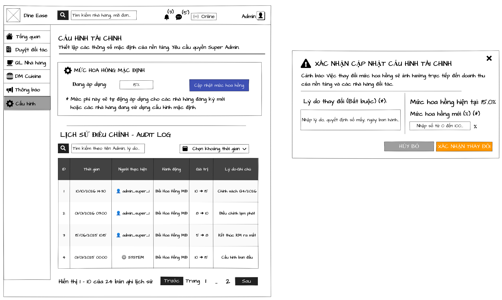

**5. UC_ADMIN_05: Báo cáo toàn hệ thống**
| Trường thông tin | Nội dung |
| :--- | :--- |
| **Use case Id** | UC_ADMIN_05 |
| **Name** (Tên use case) | Báo cáo toàn hệ thống (Dashboard & Export) |
| **Description** (Mô tả) | Use case này cho phép Quản trị viên (Admin) xem bức tranh tổng quan về hoạt động kinh doanh của toàn bộ nền tảng. Admin có thể xem các chỉ số (Tổng doanh thu hoa hồng, Tổng số lượt đặt bàn, Top nhà hàng nổi bật...), lọc dữ liệu theo khoảng thời gian tùy chỉnh và xuất báo cáo ra file (Excel/PDF) để lưu trữ hoặc phân tích thêm. |
| **Primary Actor** (Actor chính) | Admin (Quản trị hệ thống) |
| **Secondary Actor** (Actor phụ) | Hệ thống Cơ sở dữ liệu (PostgreSQL/MySQL) Thư viện tạo file (Ví dụ: Apache POI cho Excel, iText/PDFBox cho PDF) |
| **Pre-conditions** (Tiền điều kiện) | 1. Admin đã đăng nhập thành công vào hệ thống quản trị. 2. Admin có quyền truy cập module "Báo cáo & Thống kê". |
| **Post-conditions** (Hậu điều kiện) | **Thành công:** 1. Admin xem được các biểu đồ/số liệu thống kê chính xác trên màn hình. 2. File báo cáo (Excel/PDF) được tạo thành công và tải xuống máy tính của Admin.  **Thất bại:** 1. Hệ thống không hiển thị được dữ liệu hoặc không tạo được file. 2. Hệ thống hiển thị thông báo lỗi (VD: Dữ liệu quá lớn, Lỗi máy chủ). |
| **Main flows** (Luồng hoạt động chính - *Xem và Lọc dữ liệu*) | 1. Use case bắt đầu khi Admin chọn mục "Báo cáo thống kê" trên thanh menu điều hướng. 2. Hệ thống mặc định gửi yêu cầu lấy dữ liệu thống kê của **Tháng hiện tại**. 3. Backend truy vấn CSDL, tính toán tổng hợp (SUM, COUNT, GROUP BY) và trả về dữ liệu dạng JSON. 4. Hệ thống (Frontend) hiển thị Dashboard bao gồm: &nbsp;&nbsp;&nbsp;- Các thẻ số liệu (Tổng doanh thu, Tổng đơn đặt bàn thành công/hủy). &nbsp;&nbsp;&nbsp;- Biểu đồ đường (Line chart) thể hiện xu hướng đặt bàn theo ngày. &nbsp;&nbsp;&nbsp;- Danh sách "Top 5 nhà hàng có doanh thu cao nhất". 5. Admin chọn một khoảng thời gian khác (Ví dụ: "Từ 01/01/2026 đến 31/03/2026") và nhấn nút **"Lọc dữ liệu"**. 6. Hệ thống gửi yêu cầu mới với tham số `start_date` và `end_date` xuống Backend. 7. Backend tính toán lại và trả về kết quả mới. 8. Giao diện Dashboard cập nhật lại các biểu đồ và con số tương ứng với Quý 1/2026. 9. Use case kết thúc. |
| **Alternative flows** (Luồng thay thế - *Xuất file và Dữ liệu rỗng*) | **4a. Xuất báo cáo ra file (Export):** 1. Tại bước 4 (hoặc bước 8), Admin nhấn nút **"Xuất báo cáo"** và chọn định dạng **"Excel"**. 2. Hệ thống gửi yêu cầu Export xuống Backend kèm theo khoảng thời gian đang lọc. 3. Backend truy vấn dữ liệu chi tiết và sử dụng thư viện để ghi dữ liệu vào file `.xlsx`. 4. Backend trả về luồng dữ liệu file (File Stream) hoặc URL tải file. 5. Trình duyệt của Admin tự động tải file Excel xuống máy tính. 6. Use case kết thúc.  **7a. Không có dữ liệu trong khoảng thời gian đã chọn:** 1. Tại bước 7, Backend truy vấn nhưng không có bất kỳ giao dịch đặt bàn nào trong khoảng thời gian Admin chọn (VD: Chọn ngày trong tương lai). 2. Backend trả về mảng dữ liệu rỗng `[]` và các chỉ số bằng `0`. 3. Hệ thống hiển thị thông báo thân thiện trên Dashboard: *"Không có dữ liệu giao dịch nào trong khoảng thời gian này."* và ẩn các biểu đồ. 4. Luồng hoạt động quay lại Bước 5 (Chờ Admin chọn ngày khác). |
| **Exception flows** (Luồng ngoại lệ - *Lỗi hiệu năng và Hệ thống*) | **6a. Lỗi khoảng thời gian quá lớn (Validation/Performance Constraint):** 1. Tại bước 6, Admin cố tình chọn khoảng thời gian quá dài (Ví dụ: Lọc dữ liệu của 5 năm qua). 2. Backend kiểm tra logic (Validation) và nhận thấy khoảng thời gian vượt quá giới hạn cho phép truy vấn trực tiếp (VD: Giới hạn tối đa là 1 năm/lần lọc để tránh treo DB). 3. Backend từ chối truy vấn và trả về mã lỗi `400 Bad Request`. 4. Hệ thống hiển thị cảnh báo: *"Khoảng thời gian lọc quá lớn. Vui lòng chọn khoảng thời gian tối đa là 12 tháng để đảm bảo tốc độ tải dữ liệu."* 5. Admin phải chọn lại ngày.  **7b. Lỗi Quá thời gian truy vấn (Database Timeout):** 1. Tại bước 7, do lượng dữ liệu trong CSDL quá khổng lồ (hàng triệu đơn đặt bàn), câu lệnh `GROUP BY` chạy quá lâu vượt mức cho phép (VD: > 30 giây). 2. CSDL tự động ngắt kết nối (Timeout) để giải phóng tài nguyên. 3. Backend trả về mã lỗi `504 Gateway Timeout`. 4. Hệ thống hiển thị thông báo: *"Hệ thống đang quá tải do lượng dữ liệu lớn. Vui lòng thử lại sau hoặc thu hẹp khoảng thời gian lọc."*  **3a (Luồng Export). Lỗi tạo file báo cáo (Out of Memory / File Generation Error):** 1. Tại bước 3 của luồng 4a, khi Backend đang tạo file Excel với hàng trăm ngàn dòng, máy chủ bị hết RAM (Out of Memory) hoặc thư viện lỗi. 2. Backend bắt lỗi (catch exception) và trả về mã `500 Internal Server Error`. 3. Hệ thống hiển thị thông báo: *"Đã xảy ra lỗi trong quá trình tạo file Excel. Vui lòng thử lại hoặc liên hệ bộ phận kỹ thuật."* |

*Wireframe tương ứng:*
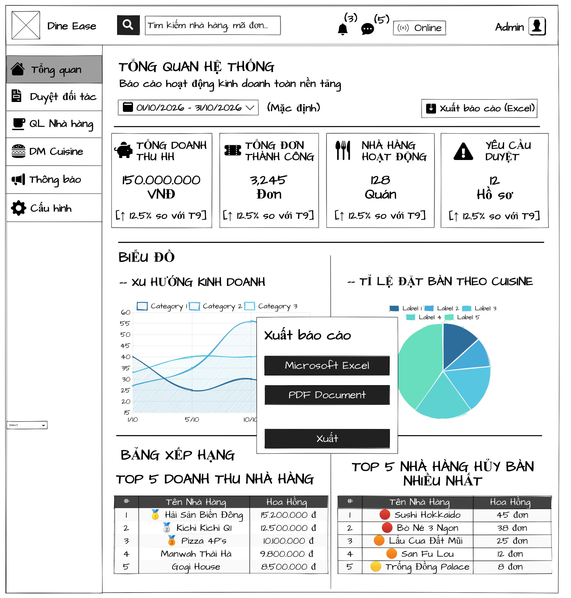

**6. UC_ADMIN_06: Quản lý thông báo**
| Trường thông tin | Nội dung |
| :--- | :--- |
| **Use case Id** | UC_ADMIN_06 |
| **Name** (Tên use case) | Quản lý thông báo (Tạo và Gửi thông báo) |
| **Description** (Mô tả) | Use case này cho phép Quản trị viên (Admin) soạn thảo và gửi các thông báo hệ thống (System Notifications) đến người dùng. Admin có thể chọn đối tượng nhận (Tất cả, Chỉ Khách hàng, Chỉ Nhà hàng, hoặc một User cụ thể), lên lịch gửi hoặc gửi ngay lập tức. Thông báo có thể được gửi qua App (Push Notification/In-app) hoặc Email. |
| **Primary Actor** (Actor chính) | Admin (Quản trị hệ thống) |
| **Secondary Actor** (Actor phụ) | Hệ thống Hàng đợi Tác vụ nền (Ví dụ: Celery + Redis) Dịch vụ gửi thông báo (Ví dụ: Firebase Cloud Messaging - FCM / JavaMail) |
| **Pre-conditions** (Tiền điều kiện) | 1. Admin đã đăng nhập thành công vào hệ thống quản trị. 2. Admin có quyền truy cập module "Quản lý Thông báo". |
| **Post-conditions** (Hậu điều kiện) | **Thành công:** 1. Một bản ghi "Chiến dịch thông báo" (Notification Campaign) được lưu vào CSDL với trạng thái `SENT` (Đã gửi) hoặc `SCHEDULED` (Đã lên lịch). 2. Tác vụ gửi thông báo được đẩy vào Hàng đợi (Queue) thành công.  **Thất bại:** 1. Không có thông báo nào được gửi đi. 2. Hệ thống hiển thị lỗi rõ ràng cho Admin. |
| **Main flows** (Luồng hoạt động chính - *Gửi thông báo ngay lập tức*) | 1. Use case bắt đầu khi Admin chọn "Quản lý Thông báo" -> "Tạo thông báo mới" trên menu. 2. Hệ thống hiển thị Form soạn thảo thông báo bao gồm: Tiêu đề, Nội dung, Đối tượng nhận (Tất cả/Khách hàng/Nhà hàng/Cá nhân), và Kênh gửi (App/Email). 3. Admin điền Tiêu đề (VD: "Bảo trì hệ thống đêm nay") và Nội dung chi tiết. 4. Admin chọn Đối tượng nhận là "Tất cả Nhà hàng" và Kênh gửi là "In-app Notification". 5. Admin nhấn nút **"Gửi thông báo"**. 6. Hệ thống (Frontend) kiểm tra tính hợp lệ (Tiêu đề/Nội dung không được rỗng). 7. Hệ thống hiển thị Dialog xác nhận: *"Bạn chuẩn bị gửi thông báo này đến [Số lượng] Nhà hàng. Xác nhận gửi?"* 8. Admin nhấn "Đồng ý". 9. Ứng dụng gửi payload (POST) xuống Backend. 10. Backend lưu bản ghi thông báo vào CSDL với trạng thái `PROCESSING` (Đang xử lý). 11. Backend đẩy tác vụ (Task) chứa nội dung và danh sách ID người nhận vào **Hàng đợi (Redis/Celery)** để xử lý ngầm (Background processing). 12. Backend trả về phản hồi thành công ngay lập tức cho Admin. 13. Hệ thống hiển thị thông báo: *"Thông báo đang được gửi đi trong nền."* và chuyển Admin về màn hình Lịch sử thông báo. 14. (Ngầm) Worker (Celery) lấy task từ hàng đợi, gọi API của Firebase (FCM) để đẩy thông báo đến các thiết bị, sau đó cập nhật trạng thái trong CSDL thành `SENT`. 15. Use case kết thúc. |
| **Alternative flows** (Luồng thay thế - *Lên lịch và Xem lịch sử*) | **4a. Lên lịch gửi thông báo (Scheduled):** 1. Tại bước 4, Admin chọn thêm tùy chọn "Lên lịch gửi" và chọn thời gian (VD: 08:00 sáng mai). 2. Tại bước 10, Backend lưu bản ghi với trạng thái `SCHEDULED` (Đã lên lịch). 3. Tại bước 11, Backend đẩy tác vụ vào Hàng đợi có hẹn giờ (Scheduled Task - VD: Celery Beat). 4. Luồng hoạt động tiếp tục tại Bước 12.  **1a. Xem Lịch sử thông báo:** 1. Tại bước 1, Admin chọn "Lịch sử thông báo". 2. Hệ thống truy vấn CSDL và hiển thị danh sách các thông báo đã tạo, bao gồm Trạng thái (`SENT`, `PROCESSING`, `FAILED`, `SCHEDULED`) và Số lượng người đã nhận/đọc. 3. Admin có thể nhấn "Xem chi tiết" hoặc "Hủy" (đối với các thông báo đang `SCHEDULED`). |
| **Exception flows** (Luồng ngoại lệ - *Lỗi Hàng đợi và Dịch vụ bên thứ 3*) | **11a. Lỗi kết nối Hàng đợi Tác vụ (Redis/Message Broker Down):** 1. Tại bước 11, Backend cố gắng đẩy tác vụ gửi thông báo vào Redis nhưng Redis bị sập (Connection Refused). 2. Backend bắt lỗi, cập nhật trạng thái bản ghi thông báo trong CSDL thành `FAILED` (Thất bại). 3. Backend trả về mã lỗi `500 Internal Server Error`. 4. Hệ thống hiển thị thông báo lỗi màu đỏ: *"Lỗi hệ thống: Không thể khởi tạo tiến trình gửi thông báo. Vui lòng liên hệ kỹ thuật."* 5. Use case kết thúc thất bại.  **14a. Lỗi Dịch vụ Firebase/Email (FCM/SMTP Error) trong lúc chạy ngầm:** 1. Tại bước 14 (tiến trình chạy ngầm), Worker đang gửi thông báo thì dịch vụ Firebase (FCM) báo lỗi (VD: Quá giới hạn API rate limit, hoặc Token thiết bị hết hạn). 2. Worker ghi log lỗi cụ thể cho từng User bị thất bại. 3. Nếu lỗi toàn hệ thống (FCM sập), Worker sẽ đưa task trở lại Hàng đợi để thử lại sau (Retry mechanism). 4. Nếu thử lại quá số lần quy định (Max retries), Worker cập nhật trạng thái chiến dịch trong CSDL thành `PARTIALLY_SENT` (Gửi một phần) hoặc `FAILED`. *(Lưu ý: Vì đây là tiến trình ngầm, Admin sẽ không thấy lỗi ngay lập tức trên màn hình, mà chỉ thấy trạng thái `FAILED` khi xem lại Lịch sử thông báo ở luồng 1a).* |

*Wireframe tương ứng:*
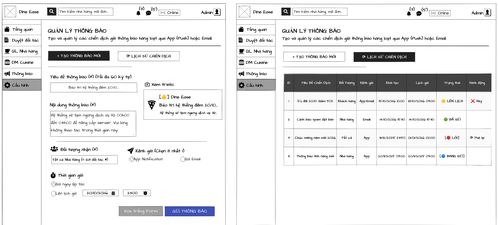

---

### 3.3. Phân hệ Nhà hàng (Restaurant / Business User)
#### 3.3.1. Sơ đồ Use Case Nhà hàng
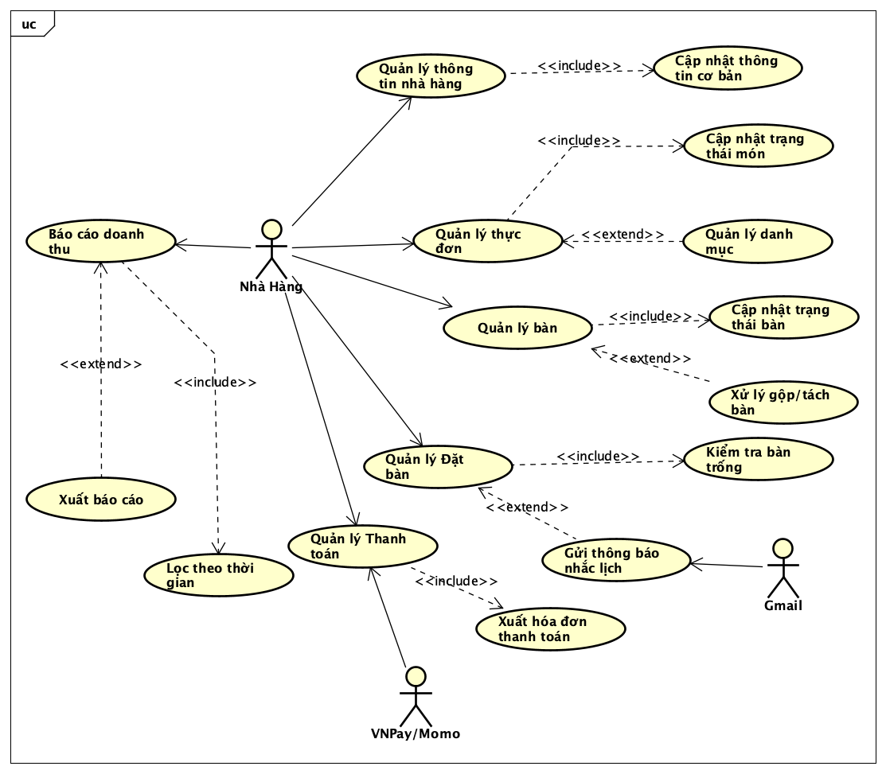

#### 3.3.2. Chi tiết Đặc tả & Wireframes
**1. UC_RESTAURANT_01: Quản lý thông tin nhà hàng**
| Trường thông tin | Nội dung |
| :--- | :--- |
| **Use case Id** | UC_RESTAURANT_01 |
| **Name** (Tên use case) | Quản lý thông tin nhà hàng |
| **Description** (Mô tả) | Use case này cho phép Chủ nhà hàng (hoặc Quản lý) xem và chỉnh sửa hồ sơ hiển thị của nhà hàng trên nền tảng. Quá trình này bắt buộc bao gồm việc cập nhật các thông tin cơ bản (Tên, Địa chỉ, Số điện thoại, Giờ mở cửa, Hình ảnh, Mô tả) để đảm bảo Khách hàng luôn tiếp cận được thông tin chính xác nhất. |
| **Primary Actor** (Actor chính) | Nhà Hàng (Business User) |
| **Secondary Actor** (Actor phụ) | Hệ thống Cơ sở dữ liệu (PostgreSQL/MySQL) Dịch vụ lưu trữ hình ảnh (Cloudinary/AWS S3) |
| **Pre-conditions** (Tiền điều kiện) | 1. Chủ nhà hàng đã đăng nhập thành công vào trang Quản trị dành cho đối tác (Restaurant Dashboard). 2. Tài khoản nhà hàng đang ở trạng thái hoạt động (Đã được Admin phê duyệt). |
| **Post-conditions** (Hậu điều kiện) | **Thành công:** 1. Dữ liệu mới của nhà hàng được cập nhật thành công vào CSDL. 2. Ứng dụng của Khách hàng lập tức hiển thị thông tin mới nhất của nhà hàng này.  **Thất bại:** 1. Dữ liệu trong CSDL không thay đổi. 2. Hệ thống hiển thị thông báo lỗi cụ thể. |
| **Main flows** (Luồng hoạt động chính) | 1. Use case bắt đầu khi Chủ nhà hàng chọn mục "Hồ sơ nhà hàng" (hoặc "Quản lý thông tin") trên thanh điều hướng của Dashboard. 2. Frontend gửi yêu cầu `GET` xuống Backend. 3. Backend truy vấn CSDL và trả về toàn bộ thông tin hiện tại của nhà hàng. 4. Frontend hiển thị Form thông tin bao gồm các trường: Tên nhà hàng, SĐT hotline, Địa chỉ, Giờ mở cửa/đóng cửa, Mô tả, và Khu vực tải ảnh (Logo, Ảnh bìa, Ảnh không gian). 5. Chủ nhà hàng tiến hành thay đổi các thông tin cần thiết. 6. Chủ nhà hàng nhấn nút **"Lưu thay đổi"**. 7. Frontend kiểm tra tính hợp lệ của các trường bắt buộc (Tên, SĐT, Địa chỉ không được để trống). Sau đó, gửi yêu cầu `PUT/PATCH` chứa payload dữ liệu mới xuống Backend. 8. Backend tiếp nhận, kiểm tra lại logic nghiệp vụ (Validation) và thực hiện lệnh `UPDATE` vào CSDL. 9. Backend trả về phản hồi thành công. 10. Frontend hiển thị thông báo: *"Cập nhật thông tin nhà hàng thành công!"* và làm mới lại giao diện với dữ liệu vừa lưu. 11. Use case kết thúc. |
| **Alternative flows** (Luồng thay thế ) | **5a. Cập nhật hình ảnh nhà hàng:** 1. Tại bước 5, Chủ nhà hàng muốn thay đổi ảnh bìa. 2. Chủ nhà hàng nhấn "Tải ảnh lên" và chọn file từ máy tính. 3. Frontend hiển thị bản xem trước của ảnh mới. 4. Tại bước 7, Frontend gửi file ảnh cùng với dữ liệu text xuống Backend. 5. Backend gọi API của **Actor Dịch vụ lưu trữ ảnh (Cloudinary)** để upload file. 6. Cloudinary trả về URL an toàn của ảnh mới. 7. Backend lưu URL này vào CSDL thay cho URL cũ. 8. Luồng hoạt động tiếp tục tại Bước 9.  **6a. Hủy bỏ thao tác chỉnh sửa:** 1. Tại bước 5, Chủ nhà hàng chọn thay đổi thông tin nhưng đổi ý, nhấn nút "Hủy" hoặc click sang một trang khác trên menu. 2. Frontend phát hiện form đã bị thay đổi và hiển thị Dialog cảnh báo: *"Bạn có những thay đổi chưa được lưu. Bạn có chắc chắn muốn rời đi?"* 3. Chủ nhà hàng nhấn "Đồng ý rời đi". 4. Frontend hủy bỏ các thay đổi tạm thời, không gọi API, và chuyển hướng sang trang khác. 5. Use case kết thúc. |
| **Exception flows** (Luồng ngoại lệ) | **7a. Lỗi logic dữ liệu (Bypass Validation / API Hacking):** 1. Tại bước 7, khi bị can thiệp vào API, gửi dữ liệu phi logic (Ví dụ: Giờ đóng cửa `18:00` lại sớm hơn Giờ mở cửa `20:00`, hoặc cố tình đổi `restaurant_id` sang nhà hàng khác). 2. Backend phát hiện vi phạm logic nghiệp vụ hoặc vi phạm phân quyền (Unauthorized). 3. Backend chặn lệnh UPDATE, trả về mã lỗi `400 Bad Request` hoặc `403 Forbidden`. 4. Frontend hiển thị thông báo lỗi màu đỏ: *"Dữ liệu không hợp lệ. Giờ đóng cửa phải sau giờ mở cửa."* hoặc *"Bạn không có quyền chỉnh sửa thông tin này."* 5. Use case kết thúc thất bại.  **5b (Luồng 5a). Lỗi Dịch vụ lưu trữ ảnh (Cloudinary Timeout):** 1. Tại bước 5 của luồng 5a, Backend gọi API upload ảnh nhưng Cloudinary bị sập hoặc nghẽn mạng. 2. Backend bắt lỗi (catch exception), hủy bỏ toàn bộ giao dịch cập nhật (Rollback) để tránh việc lưu text mới nhưng mất ảnh. 3. Backend trả về mã `502 Bad Gateway`. 4. Frontend hiển thị thông báo: *"Hệ thống tải ảnh đang gặp sự cố. Vui lòng thử lại sau ít phút."*  **8a. Lỗi mất kết nối Cơ sở dữ liệu (Database Error):** 1. Tại bước 8, Backend không thể lưu bản ghi vào PostgreSQL/MySQL do CSDL bị sập. 2. Backend trả về mã `500 Internal Server Error`. 3. Frontend hiển thị thông báo: *"Hệ thống đang bận, không thể lưu thay đổi lúc này."* |

---
*Wireframe tương ứng:*

**2. UC_RESTAURANT_02: Quản lý thực đơn**
| Trường thông tin | Nội dung |
| :--- | :--- |
| **Use case Id** | UC_RESTAURANT_02 |
| **Name** (Tên use case) | Quản lý thực đơn (CRUD món ăn) |
| **Description** (Mô tả) | Use case này cho phép Chủ nhà hàng (hoặc Quản lý) xem, thêm mới, chỉnh sửa, và xóa các món ăn/đồ uống trong thực đơn của mình. Quá trình này bắt buộc bao gồm chức năng bật/tắt trạng thái món ăn nhanh chóng. Ngoài ra, người dùng có thể mở rộng sang việc tạo/chỉnh sửa các danh mục món ăn (Categories) để phân nhóm thực đơn một cách khoa học. |
| **Primary Actor** (Actor chính) | Nhà Hàng (Business User) |
| **Secondary Actor** (Actor phụ) | Hệ thống Cơ sở dữ liệu (PostgreSQL/MySQL) Dịch vụ lưu trữ hình ảnh (Cloudinary / AWS S3) |
| **Pre-conditions** (Tiền điều kiện) | 1. Chủ nhà hàng đã đăng nhập thành công vào trang Quản trị (Restaurant Dashboard). 2. Tài khoản nhà hàng đang ở trạng thái hoạt động. |
| **Post-conditions** (Hậu điều kiện) | **Thành công:** 1. Dữ liệu món ăn/danh mục mới được cập nhật thành công vào CSDL. 2. Ứng dụng của Khách hàng lập tức hiển thị thực đơn mới nhất.  **Thất bại:** 1. Không có thay đổi nào được lưu vào CSDL. 2. Hệ thống hiển thị thông báo lỗi cụ thể. |
| **Main flows** (Luồng hoạt động chính - *Thêm/Sửa món ăn*) | 1. Use case bắt đầu khi Chủ nhà hàng chọn mục "Quản lý Thực đơn" trên thanh điều hướng. 2. Hệ thống truy vấn CSDL và hiển thị danh sách toàn bộ món ăn, được phân nhóm theo từng Danh mục (Khai vị, Món chính, Đồ uống). 3. Chủ nhà hàng nhấn nút **"Thêm món mới"** (hoặc "Chỉnh sửa" một món có sẵn). 4. Hệ thống hiển thị Form thông tin món ăn bao gồm: Tên món, Giá tiền, Hình ảnh minh họa, Mô tả thành phần, và Dropdown chọn Danh mục. 5. Chủ nhà hàng điền đầy đủ thông tin và tải lên hình ảnh món ăn. 6. Chủ nhà hàng nhấn nút **"Lưu món ăn"**. 7. Frontend kiểm tra tính hợp lệ (Tên món, Giá tiền không được trống). 8. Frontend gửi yêu cầu `POST/PUT` kèm dữ liệu (bao gồm cả file ảnh) xuống Backend. 9. Backend gọi API của **Actor Cloudinary** để lưu trữ hình ảnh và nhận lại URL. 10. Backend lưu toàn bộ thông tin món ăn (kèm URL ảnh) vào CSDL. 11. Hệ thống hiển thị thông báo: *"Đã lưu món ăn thành công!"* và tải lại danh sách thực đơn (Bước 2). 12. Use case kết thúc. |
| **Alternative flows** (Luồng thay thế) | **2a. Thao tác nhanh (`Cập nhật trạng thái món`):** 1. Tại bước 2, ngay trên danh sách thực đơn, mỗi món ăn có một nút gạt (Toggle switch) thể hiện trạng thái: "Đang bán" (Available) hoặc "Hết hàng" (Sold out). 2. Khi bếp báo hết nguyên liệu, Chủ nhà hàng click vào nút gạt của món đó để chuyển sang "Hết hàng". 3. Frontend gửi ngay một yêu cầu `PATCH` (chỉ chứa ID món và trạng thái mới) xuống Backend. 4. Backend cập nhật trường `status` trong CSDL. 5. Hệ thống hiển thị thông báo nhỏ (Toast): *"Đã cập nhật trạng thái món ăn."* Khách hàng sẽ không thể đặt món này nữa. 6. Luồng hoạt động tiếp tục tại Bước 2.  **4a. Thêm nhóm món ăn mới (`Quản lý danh mục`):** 1. Tại bước 4, khi đang tạo món mới, Chủ nhà hàng nhận ra chưa có danh mục phù hợp (Muốn thêm món mới nhưng chưa có danh mục). 2. Chủ nhà hàng nhấn vào nút **"+ Thêm danh mục mới"** nằm cạnh Dropdown chọn danh mục. 3. Hệ thống hiển thị một Popup nhỏ yêu cầu nhập Tên danh mục. 4. Chủ nhà hàng nhập tên danh mục mới và nhấn Lưu. 5. Backend tạo bản ghi Danh mục mới trong CSDL và trả về ID. 6. Popup đóng lại, Dropdown tự động cập nhật và chọn sẵn danh mục vừa tạo. 7. Luồng hoạt động tiếp tục tại Bước 5. |
| **Exception flows** (Luồng ngoại lệ ) | **8a. Lỗi logic dữ liệu (Bypass Validation / API Hacking):** 1. Tại bước 8, nếu cố tình dùng công cụ can thiệp API để truyền lên Giá tiền là số âm hoặc gán món ăn vào một ID Danh mục không thuộc về nhà hàng của mình. 2. Backend (thông qua Spring Validation và Logic Check) phát hiện dữ liệu phi lý hoặc vi phạm quyền sở hữu dữ liệu. 3. Backend chặn lệnh INSERT/UPDATE, trả về mã lỗi `400 Bad Request` hoặc `403 Forbidden`. 4. Frontend hiển thị thông báo lỗi: *"Giá tiền không hợp lệ"* hoặc *"Bạn không có quyền thêm món vào danh mục này."* 5. Use case kết thúc thất bại.  **9a. Lỗi Dịch vụ lưu trữ ảnh (Cloudinary Timeout):** 1. Tại bước 9, Backend gọi API upload ảnh món ăn nhưng Cloudinary bị sập hoặc nghẽn mạng. 2. Backend bắt lỗi (catch exception), hủy bỏ toàn bộ giao dịch (Rollback) để tránh việc tạo ra một món ăn bị lỗi hình ảnh (broken image) trên app của Khách hàng. 3. Backend trả về mã `502 Bad Gateway`. 4. Frontend hiển thị thông báo: *"Hệ thống tải ảnh đang gặp sự cố. Vui lòng thử lại sau ít phút."*  **10a. Lỗi mất kết nối Cơ sở dữ liệu (Database Error):** 1. Tại bước 10, Backend không thể lưu bản ghi vào PostgreSQL/MySQL do CSDL bị sập. 2. Backend trả về mã `500 Internal Server Error`. 3. Frontend hiển thị thông báo: *"Hệ thống đang bận, không thể lưu thực đơn lúc này."* |

---
*Wireframe tương ứng:*

**3. UC_RESTAURANT_03: Quản lý bàn (Sơ đồ bàn)**
| Trường thông tin | Nội dung |
| :--- | :--- |
| **Use case Id** | UC_RESTAURANT_03 |
| **Name** (Tên use case) | Quản lý bàn (Sơ đồ bàn) |
| **Description** (Mô tả) | Use case này cho phép Nhân viên/Quản lý nhà hàng theo dõi và điều phối chỗ ngồi của khách hàng thông qua một sơ đồ bàn trực quan. Quá trình này bắt buộc phải bao gồm việc cập nhật trạng thái thực tế của từng bàn (Trống, Có khách, Đã đặt trước...). Ngoài ra, hệ thống hỗ trợ tính năng mở rộng để gộp hoặc tách các bàn khi có yêu cầu đặc biệt từ nhóm khách đông. |
| **Primary Actor** (Actor chính) | Nhà Hàng (Business User / Lễ tân) |
| **Secondary Actor** (Actor phụ) | Hệ thống Cơ sở dữ liệu (PostgreSQL/MySQL) |
| **Pre-conditions** (Tiền điều kiện) | 1. Nhân viên nhà hàng đã đăng nhập thành công vào hệ thống (POS/Dashboard). 2. Nhà hàng đã thiết lập sẵn danh sách các bàn (Tên bàn, Sức chứa) trong CSDL. |
| **Post-conditions** (Hậu điều kiện) | **Thành công:** 1. Sơ đồ bàn hiển thị chính xác trạng thái hiện tại của nhà hàng. 2. Các thay đổi trạng thái hoặc gộp/tách bàn được lưu vào CSDL và đồng bộ theo thời gian thực (nếu có dùng WebSocket).  **Thất bại:** 1. Trạng thái bàn không thay đổi. 2. Hệ thống hiển thị thông báo lỗi. |
| **Main flows** (Luồng hoạt động chính - *Xem sơ đồ và Cập nhật trạng thái*) | 1. Use case bắt đầu khi Nhân viên chọn mục "Sơ đồ bàn" trên màn hình chính. 2. Frontend gửi yêu cầu `GET` xuống Backend để lấy danh sách toàn bộ bàn và trạng thái hiện tại của chúng. 3. Backend truy vấn CSDL và trả về danh sách bàn. 4. Frontend hiển thị giao diện Sơ đồ bàn trực quan, sử dụng màu sắc để phân biệt trạng thái (Xanh = Trống, Đỏ = Có khách, Vàng = Đã đặt). 5. Nhân viên quan sát sơ đồ để sắp xếp chỗ cho khách mới đến. 6. Khách hàng đến nhận Bàn (đã đặt trước). Nhân viên click vào biểu tượng Bàn trên sơ đồ. 7. Hệ thống hiển thị một Popup/Menu ngữ cảnh với các tùy chọn hành động. 8. Nhân viên chọn hành động **"Check-in (Đón khách)"**. 9. Frontend gửi yêu cầu `PATCH` (chứa `table_id` và `status = OCCUPIED`) xuống Backend. 10. Backend cập nhật trạng thái bàn trong CSDL và liên kết bàn này với đơn đặt bàn tương ứng (nếu có). 11. Backend trả về phản hồi thành công. 12. Frontend thay đổi màu sắc của Bàn 3 sang màu Đỏ (Có khách). 13. Use case kết thúc. |
| **Alternative flows** (Luồng thay thế) | **8a. Bàn ăn xong, khách rời đi (`Cập nhật trạng thái bàn`):** 1. Tại bước 8, khách ở Bàn khác đã thanh toán xong và rời đi. Nhân viên click vào Bàn trống và chọn **"Dọn dẹp"**. 2. Backend cập nhật trạng thái thành `CLEANING` (Màu cam). 3. Sau khi dọn xong, nhân viên click lại và chọn **"Bàn trống"**. 4. Backend cập nhật trạng thái thành `AVAILABLE` (Màu xanh). 5. Luồng hoạt động tiếp tục tại Bước 11.  **8b. Khách đi nhóm đông (`Xử lý gộp/tách bàn`):** 1. Tại bước 8, một nhóm khách đến nhưng nhà hàng chỉ còn các bàn nhỏ không đủ cho nhóm. 2. Nhân viên click  chọn tính năng **"Gộp bàn" (Merge Tables)**. 3. Hệ thống hiển thị danh sách các bàn đang trống xung quanh. Nhân viên tick chọn Bàn và nhấn "Xác nhận gộp". 4. Frontend gửi yêu cầu `POST` xuống Backend để tạo một "Nhóm bàn tạm thời" (Table Group). 5. Backend cập nhật trạng thái cả 2 bàn thành `OCCUPIED` và liên kết chúng chung một mã hóa đơn (Order ID). 6. Sơ đồ bàn hiển thị các Bàn đã gộp cùng một viền màu. 7. *(Khi khách về, nhân viên chọn "Tách bàn" để trả 2 bàn về trạng thái độc lập ban đầu).* 8. Luồng hoạt động tiếp tục tại Bước 11. |
| **Exception flows** (Luồng ngoại lệ) | **8c (Luồng 8b). Lỗi logic gộp bàn (Bypass Validation):** 1. Tại bước 4 của luồng 8b, Nhân viên (do nhầm lẫn hoặc lỗi UI) gửi lệnh gộp Bàn nhầm. 2. Backend kiểm tra logic nghiệp vụ và phát hiện Bàn đó không ở trạng thái `AVAILABLE`. 3. Backend chặn lệnh gộp bàn, trả về mã lỗi `409 Conflict` hoặc `400 Bad Request`. 4. Frontend hiển thị thông báo lỗi: *"Không thể gộp bàn. Bàn hiện đang có khách hoặc chưa được dọn dẹp."* 5. Nhân viên phải chọn lại bàn khác hợp lệ.  **9a. Xung đột cập nhật đồng thời (Race Condition):** 1. Tại bước 9, Lễ tân này vừa bấm "Check-in" cho Bàn. Cùng lúc đó (chênh lệch vài mili-giây), Lễ tân kia ở máy tính khác cũng bấm "Check-in" cho một nhóm khách vãng lai vào chính Bàn đó. 2. Backend (thông qua cơ chế Optimistic Locking hoặc Transaction) phát hiện trạng thái Bàn đã bị thay đổi bởi Lễ tân khác. 3. Backend từ chối yêu cầu của Lễ tân phản hồi sau và trả về mã lỗi `409 Conflict`. 4. Máy của Lễ tân sau hiển thị thông báo: *"Bàn vừa được nhân viên khác cập nhật. Vui lòng chọn bàn khác."* và tự động tải lại sơ đồ bàn mới nhất.  **10a. Lỗi mất kết nối Cơ sở dữ liệu (Database Error):** 1. Tại bước 10, Backend không thể lưu trạng thái bàn vào PostgreSQL/MySQL do CSDL bị sập. 2. Backend trả về mã `500 Internal Server Error`. 3. Frontend hiển thị thông báo: *"Hệ thống đang bận, không thể cập nhật trạng thái bàn lúc này."* |

---

*Wireframe tương ứng:*

**4. UC_RESTAURANT_04: Quản lý thanh toán**
| Trường thông tin | Nội dung |
| :--- | :--- |
| **Use case Id** | UC_RESTAURANT_04 |
| **Name** (Tên use case) | Quản lý thanh toán |
| **Description** (Mô tả) | Use case này cho phép Thu ngân hoặc Quản lý nhà hàng thực hiện chốt bill và thu tiền của khách hàng sau khi dùng bữa. Quá trình này hỗ trợ nhiều phương thức thanh toán (Tiền mặt, Thẻ, hoặc qua cổng điện tử VNPay/Momo). Sau khi giao dịch thành công, hệ thống bắt buộc phải xuất hóa đơn (dưới dạng PDF/Excel) để in cho khách hoặc lưu trữ. |
| **Primary Actor** (Actor chính) | Nhà Hàng (Thu ngân / Quản lý) |
| **Secondary Actor** (Actor phụ) | Hệ thống Cơ sở dữ liệu (PostgreSQL/MySQL) Cổng thanh toán (VNPay / Momo) Trình tạo file (Pdf / Excel) |
| **Pre-conditions** (Tiền điều kiện) | 1. Thu ngân đã đăng nhập thành công vào hệ thống POS/Dashboard của nhà hàng. 2. Có một bàn/đơn hàng đang ở trạng thái "Đang phục vụ" và khách hàng yêu cầu thanh toán (chốt bill). |
| **Post-conditions** (Hậu điều kiện) | **Thành công:** 1. Trạng thái đơn hàng/bàn chuyển sang `PAID` (Đã thanh toán) và bàn được giải phóng (chuyển sang `CLEANING` hoặc `AVAILABLE`). 2. Doanh thu được ghi nhận vào CSDL. 3. Hóa đơn PDF/Excel được tạo thành công.  **Thất bại:** 1. Đơn hàng giữ nguyên trạng thái chưa thanh toán. 2. Hệ thống hiển thị thông báo lỗi. |
| **Main flows** (Luồng hoạt động chính - *Thanh toán tiền mặt & Xuất hóa đơn*) | 1. Use case bắt đầu khi Thu ngân chọn một bàn đang có khách và nhấn nút **"Thanh toán"**. 2. Hệ thống truy vấn CSDL và hiển thị chi tiết Hóa đơn tạm tính (Danh sách món, Thuế VAT, Phí dịch vụ, Tiền cọc đã đóng nếu có, và Tổng tiền cần thanh toán). 3. Thu ngân xác nhận lại các món ăn với khách hàng. 4. Thu ngân chọn phương thức thanh toán là **"Tiền mặt"** (Cash) và nhập số tiền khách đưa. 5. Hệ thống tự động tính số tiền thối lại (tiền thừa). 6. Thu ngân nhấn nút **"Xác nhận thanh toán"**. 7. Backend cập nhật trạng thái đơn hàng thành `PAID` và lưu lịch sử giao dịch vào CSDL. 8. Ngay sau khi lưu CSDL thành công, Backend tự động gọi module xuất file. 9. Backend tương tác với **Actor Pdf/Excel** để render (tạo) một file hóa đơn định dạng `.pdf` chứa đầy đủ thông tin bill. 10. Backend trả về URL của file PDF cho Frontend. 11. Frontend hiển thị thông báo: *"Thanh toán thành công"* và tự động mở hộp thoại In hóa đơn (Print dialog) từ file PDF vừa tạo. 12. Use case kết thúc. |
| **Alternative flows** (Luồng thay thế - *Thanh toán qua cổng điện tử*) | **4a. Thanh toán qua ví điện tử (`Tương tác với Actor VNPay/Momo`):** 1. Tại bước 4, Thu ngân chọn phương thức thanh toán là **"VNPay / Momo"**. 2. Backend tạo một mã giao dịch và gọi API của **Actor VNPay/Momo** để tạo mã QR thanh toán động (chứa sẵn số tiền). 3. Frontend hiển thị mã QR này lên màn hình (hoặc màn hình phụ hướng về phía khách). 4. Khách hàng sử dụng điện thoại quét mã QR và xác nhận thanh toán. 5. **Actor VNPay/Momo** xử lý giao dịch và gửi một Webhook (IPN) ngầm về Backend của hệ thống thông báo giao dịch thành công. 6. Backend nhận IPN, xác thực chữ ký bảo mật, và tự động cập nhật trạng thái đơn hàng thành `PAID`. 7. Frontend (đang polling hoặc dùng WebSocket) nhận được tín hiệu thành công, tự động chuyển sang màn hình hoàn tất. 8. Luồng hoạt động tiếp tục tại Bước 8 (Xuất hóa đơn).  **2a. Áp dụng mã giảm giá / Voucher tại quầy:** 1. Tại bước 2, khách hàng đưa mã giảm giá. Thu ngân nhập mã vào ô "Voucher / Giảm giá". 2. Backend kiểm tra tính hợp lệ của mã. Nếu hợp lệ, hệ thống tính toán lại Tổng tiền cuối cùng. 3. Luồng hoạt động tiếp tục tại Bước 3. |
| **Exception flows** (Luồng ngoại lệ) | **5a (Luồng 4a). Lỗi Cổng thanh toán (VNPay/Momo Timeout):** 1. Tại bước 5 của luồng 4a, khách hàng đã quét mã và bị trừ tiền, nhưng hệ thống VNPay/Momo bị nghẽn mạng, không gửi IPN về Backend. 2. Frontend chờ quá thời gian quy định (Ví dụ: 3 phút) mà không thấy phản hồi. 3. Frontend hiển thị cảnh báo: *"Chưa nhận được xác nhận từ cổng thanh toán."* 4. Thu ngân nhấn nút **"Kiểm tra trạng thái giao dịch"**. Backend chủ động gọi API Query sang VNPay/Momo để hỏi trạng thái. 5. Nếu VNPay/Momo trả về lỗi `500` hoặc báo giao dịch thất bại, Thu ngân thỏa thuận với khách để thanh toán lại bằng Tiền mặt.  **8a. Lỗi tạo file Hóa đơn (Actor Pdf/Excel Crash):** 1. Tại bước 9, khi Backend đang tạo file PDF, máy chủ bị hết RAM (Out of Memory) hoặc thư viện tạo PDF bị lỗi. 2. Backend bắt lỗi (catch exception). **Lưu ý:** Giao dịch thanh toán (tiền) đã được lưu thành công ở bước 7, nên KHÔNG rollback CSDL. 3. Backend trả về mã lỗi `500 Internal Server Error` cho tiến trình tạo file. 4. Frontend hiển thị thông báo cảnh báo (Warning): *"Thanh toán thành công, nhưng hệ thống gặp lỗi khi tạo file in hóa đơn. Vui lòng thử in lại trong mục Lịch sử."*  **6a. Xung đột dữ liệu (Concurrent Modification / Race Condition):** 1. Tại bước 6, Thu ngân A nhấn "Xác nhận thanh toán". Cùng lúc đó (chênh vài mili-giây), một Nhân viên phục vụ B dùng tablet order thêm 1 món "Bia" vào chính bàn đó. 2. Backend kiểm tra tổng số tiền hoặc version của đơn hàng (Optimistic Locking) và phát hiện sự sai lệch. 3. Backend chặn thanh toán, trả về mã lỗi `409 Conflict`. 4. Frontend hiển thị thông báo: *"Đơn hàng vừa bị thay đổi (thêm/bớt món). Vui lòng tải lại trang để xem tổng tiền mới nhất trước khi thanh toán."* |

---

*Wireframe tương ứng:*

**5. UC_RESTAURANT_05: Báo cáo doanh thu**
| Trường thông tin | Nội dung |
| :--- | :--- |
| **Use case Id** | UC_RESTAURANT_05 |
| **Name** (Tên use case) | Báo cáo doanh thu |
| **Description** (Mô tả) | Use case này cho phép Chủ nhà hàng hoặc Quản lý theo dõi hiệu quả kinh doanh thông qua các biểu đồ và số liệu thống kê (Tổng doanh thu, số đơn hoàn thành, số đơn hủy...). Quá trình này bắt buộc phải đi kèm thao tác lọc dữ liệu theo một khoảng thời gian nhất định. Ngoài ra, người dùng có thể mở rộng bằng cách xuất dữ liệu ra file (PDF/Excel) để lưu trữ hoặc báo cáo cấp trên. |
| **Primary Actor** (Actor chính) | Nhà Hàng (Business User / Quản lý) |
| **Secondary Actor** (Actor phụ) | Hệ thống Cơ sở dữ liệu (PostgreSQL/MySQL) Trình tạo file (Actor Pdf / Excel) |
| **Pre-conditions** (Tiền điều kiện) | 1. Quản lý nhà hàng đã đăng nhập thành công vào hệ thống (Restaurant Dashboard). 2. Tài khoản có quyền truy cập module "Báo cáo & Thống kê". |
| **Post-conditions** (Hậu điều kiện) | **Thành công:** 1. Hệ thống hiển thị chính xác các biểu đồ, con số thống kê theo khoảng thời gian đã chọn. 2. File báo cáo được tạo và tải xuống thành công (nếu có yêu cầu).  **Thất bại:** 1. Giao diện không hiển thị được dữ liệu. 2. Hệ thống báo lỗi. |
| **Main flows** (Luồng hoạt động chính - *Xem báo cáo mặc định*) | 1. Use case bắt đầu khi Quản lý chọn mục "Báo cáo doanh thu" trên thanh menu điều hướng. 2. Hệ thống (Frontend) tự động thiết lập khoảng thời gian mặc định là **"Tháng hiện tại"** (Từ ngày 1 đến ngày hiện tại) và gửi yêu cầu `GET` xuống Backend kèm tham số `start_date`, `end_date`. 3. Backend tiếp nhận yêu cầu, thực hiện truy vấn tổng hợp dữ liệu (Aggregation query: SUM doanh thu, COUNT số đơn) từ CSDL dựa trên ID của nhà hàng và khoảng thời gian. 4. Backend trả về dữ liệu dưới dạng JSON. 5. Frontend nhận dữ liệu và vẽ lên giao diện Dashboard bao gồm: &nbsp;&nbsp;&nbsp;- Các thẻ tổng quát: Tổng doanh thu, Tổng số đơn, Tỉ lệ hủy bàn. &nbsp;&nbsp;&nbsp;- Biểu đồ đường (Line chart): Biến động doanh thu theo từng ngày. &nbsp;&nbsp;&nbsp;- Danh sách: Top món ăn bán chạy nhất. 6. Quản lý xem xét các số liệu trên màn hình. 7. Use case kết thúc. |
| **Alternative flows** (Luồng thay thế - *Đoán trước được, có hướng xử lý/mở rộng*) | **2a. Thay đổi bộ lọc thời gian (`Lọc theo thời gian`):** 1. Tại bước 5, Quản lý muốn xem dữ liệu của tháng trước. Quản lý click vào bộ chọn ngày (Date Picker). 2. Quản lý chọn khoảng thời gian mới ("Tháng trước" hoặc tùy chọn) và nhấn "Áp dụng". 3. Frontend gửi lại yêu cầu `GET` với tham số thời gian mới. 4. Luồng hoạt động quay lại Bước 3 để tải và vẽ lại biểu đồ mới.  **6a. Xuất dữ liệu ra file (`Xuất báo cáo`):** 1. Tại bước 5 hoặc 6, Quản lý nhấn vào nút **"Xuất báo cáo"** và chọn định dạng **"Excel"** (hoặc PDF). 2. Frontend gửi yêu cầu Export xuống Backend, đính kèm khoảng thời gian đang hiển thị trên màn hình. 3. Backend truy vấn dữ liệu chi tiết và chuyển giao cho **Actor Pdf/Excel** (các thư viện như Apache POI / iText). 4. **Actor Pdf/Excel** xử lý và tạo ra một file vật lý chứa các bảng biểu thống kê. 5. Backend trả về luồng dữ liệu (File Stream) cho Frontend. 6. Trình duyệt của Quản lý tự động tải file `Bao_cao_doanh_thu.xlsx` xuống máy tính. 7. Luồng hoạt động tiếp tục tại Bước 6.  **4a. Không có dữ liệu kinh doanh (Empty State):** 1. Tại bước 3, Backend truy vấn nhưng nhà hàng không có bất kỳ đơn hàng nào trong khoảng thời gian được chọn. 2. Backend trả về các chỉ số bằng `0` và danh sách rỗng `[]`. 3. Frontend hiển thị giao diện trống với thông báo thân thiện: *"Không có dữ liệu giao dịch nào trong khoảng thời gian này."* và ẩn các biểu đồ. 4. Quản lý có thể chọn lại khoảng thời gian khác (Quay lại luồng 2a). |
| **Exception flows** (Luồng ngoại lệ) | **2b. Lỗi khoảng thời gian quá lớn (Bypass Validation / Performance Protection):** 1. Tại bước 2 (của luồng 2a), Quản lý cố tình chọn khoảng thời gian quá dài hoặc dùng tool can thiệp API truyền `start_date` > `end_date`. 2. Backend kiểm tra logic và phát hiện khoảng thời gian không hợp lệ hoặc vượt quá giới hạn truy vấn cho phép để chống treo DB. 3. Backend chặn truy vấn, trả về mã lỗi `400 Bad Request`. 4. Frontend hiển thị cảnh báo: *"Khoảng thời gian không hợp lệ hoặc vượt quá 12 tháng. Vui lòng chọn lại để đảm bảo tốc độ tải."* 5. Use case kết thúc thất bại.  **3a. Lỗi Quá thời gian truy vấn (Database Timeout):** 1. Tại bước 3, do lượng dữ liệu của nhà hàng quá lớn, câu lệnh `GROUP BY` chạy quá lâu vượt mức cho phép (> 30 giây). 2. CSDL tự động ngắt kết nối (Timeout) để bảo vệ tài nguyên máy chủ. 3. Backend trả về mã lỗi `504 Gateway Timeout` hoặc `500 Internal Server Error`. 4. Frontend hiển thị thông báo: *"Hệ thống đang xử lý lượng dữ liệu lớn. Vui lòng thử lại sau hoặc thu hẹp khoảng thời gian lọc."*  **4b (Luồng 6a). Lỗi tạo file báo cáo (Actor Pdf/Excel Crash / Out of Memory):** 1. Tại bước 4 của luồng 6a, khi **Actor Pdf/Excel** đang cố gắng ghi 100.000 dòng dữ liệu vào file Excel, máy chủ bị tràn RAM (Out of Memory) hoặc thư viện bị crash. 2. Backend bắt lỗi (catch exception) và trả về mã `500 Internal Server Error`. 3. Frontend hiển thị thông báo: *"Đã xảy ra lỗi trong quá trình tạo file báo cáo. Vui lòng liên hệ kỹ thuật hoặc thử lại sau."* |

---
*Wireframe tương ứng:*
